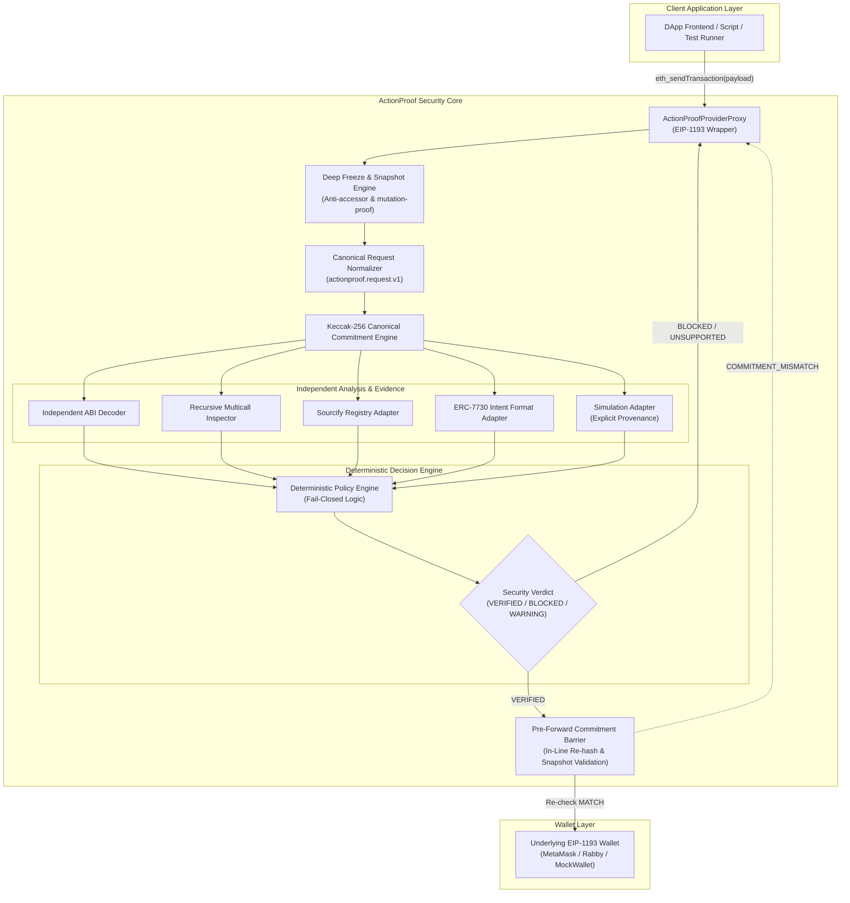
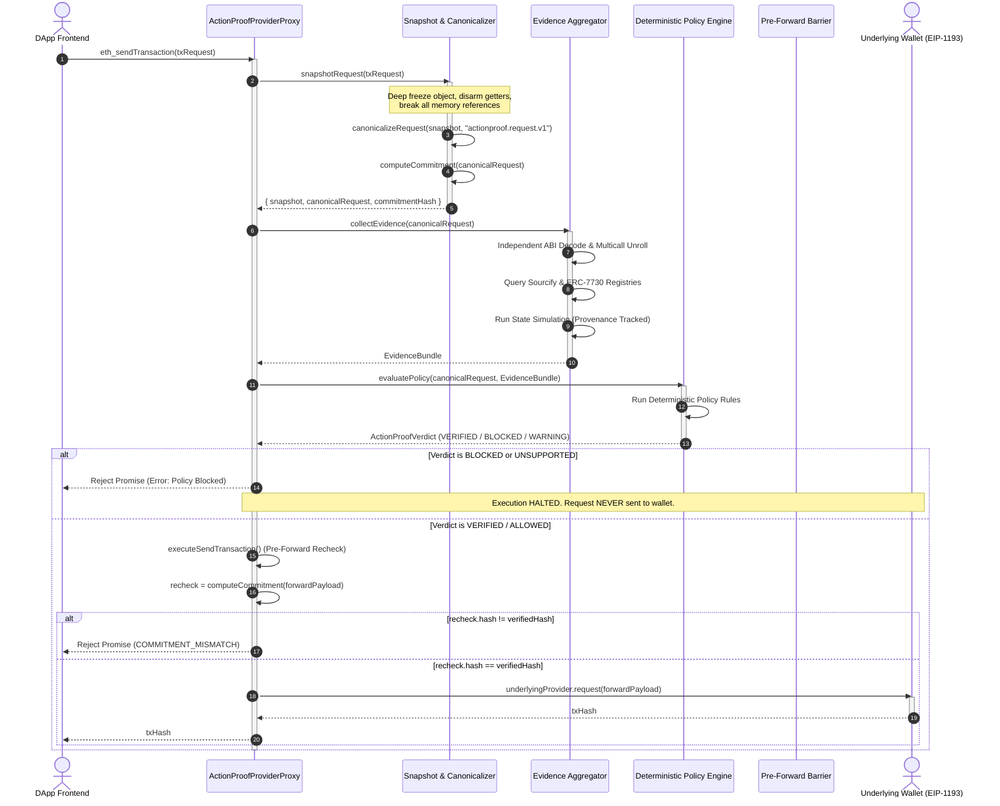
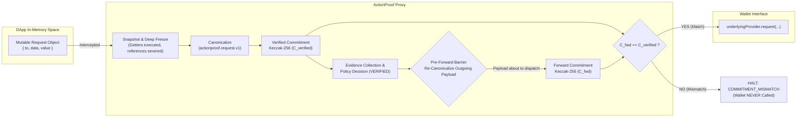
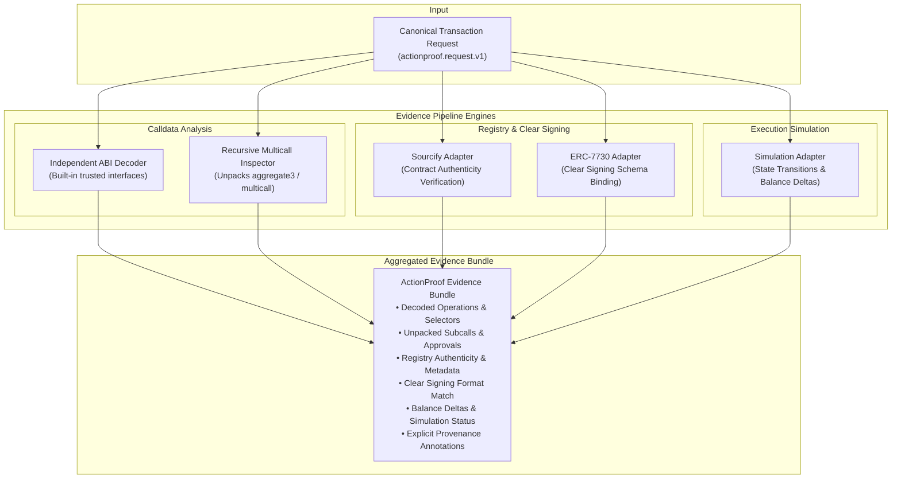
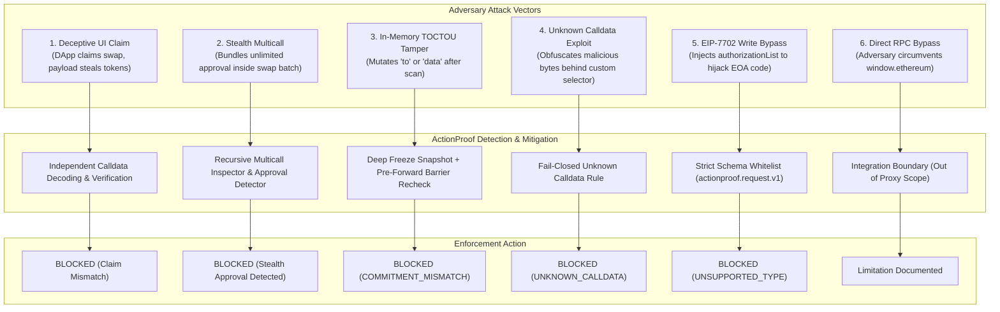
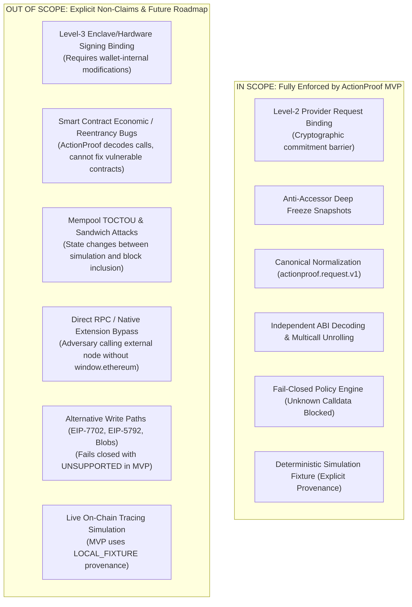

# ActionProof — Pre-Signing Ethereum Security Gate

[](https://www.typescriptlang.org/)
[]()
[]()
[]()
[]()
[](LICENSE)

> **Official Repository:** [https://github.com/Abhi010903/ActionProofETR](https://github.com/Abhi010903/ActionProofETR)  
> **Ecosystem:** Ethereum  
> **Specification Baseline:** Frozen v1.0.0 (`ActionProof_Final_Build_Spec_FINAL.zip`)  
> **Security Level:** Level-2 Canonical Transaction-Request Binding  

---

## Table of Contents

1. [Executive Summary / Elevator Pitch](#1-executive-summary--elevator-pitch)
2. [Problem Statement & The Pre-Signing Gap](#2-problem-statement--the-pre-signing-gap)
3. [The 4 Core Security Questions Answered](#3-the-4-core-security-questions-answered)
4. [High-Level Architecture (Diagram 1)](#4-high-level-architecture-diagram-1)
5. [Security Model & Trust Boundaries](#5-security-model--trust-boundaries)
6. [Runtime Verification Flow (Diagram 2)](#6-runtime-verification-flow-diagram-2)
7. [Level-2 Provider Request Binding Invariant (Diagram 3)](#7-level-2-provider-request-binding-invariant-diagram-3)
8. [Anti-Accessor & Anti-Tamper Hardening](#8-anti-accessor--anti-tamper-hardening)
9. [Independent Evidence Pipeline (Diagram 4)](#9-independent-evidence-pipeline-diagram-4)
10. [Recursive Multicall Inspection & Approval Detection](#10-recursive-multicall-inspection--approval-detection)
11. [Sourcify & Contract Identity Adapter](#11-sourcify--contract-identity-adapter)
12. [ERC-7730 Clear Signing Adapter](#12-erc-7730-clear-signing-adapter)
13. [Simulation Adapter & Honest Provenance](#13-simulation-adapter--honest-provenance)
14. [Deterministic Policy Engine & Ruleset](#14-deterministic-policy-engine--ruleset)
15. [Pre-Forward Commitment Barrier & Re-check](#15-pre-forward-commitment-barrier--re-check)
16. [Attack-Defense Matrix (Diagram 5)](#16-attack-defense-matrix-diagram-5)
17. [Supported vs. Unsupported Scope (Diagram 6)](#17-supported-vs-unsupported-scope-diagram-6)
18. [Explicit Limitations & Non-Claims](#18-explicit-limitations--non-claims)
19. [The 5 Evaluator Demo Scenarios](#19-the-5-evaluator-demo-scenarios)
20. [Interactive Security Console & Observability UX](#20-interactive-security-console--observability-ux)
21. [5-Minute Evaluator Quickstart](#21-5-minute-evaluator-quickstart)
22. [Automated Verification Triad](#22-automated-verification-triad)
23. [Test Suite Structure & Coverage Highlights](#23-test-suite-structure--coverage-highlights)
24. [Codebase Directory Map & Subsystem Structure](#24-codebase-directory-map--subsystem-structure)
25. [Implementation Tech Stack & Dependencies](#25-implementation-tech-stack--dependencies)
26. [Security Decisions & Design Rationale](#26-security-decisions--design-rationale)
27. [Comprehensive Documentation Index](#27-comprehensive-documentation-index)
28. [Future Roadmap](#28-future-roadmap)
29. [Repository & License Information](#29-repository--license-information)

---

## 1. Executive Summary / Elevator Pitch

**ActionProof** is a pre-signing Ethereum security enforcement gate that solves the pre-signing authorization gap at the **EIP-1193** provider boundary.

Instead of passively warning users or relying on non-deterministic LLMs, ActionProof sits directly in the execution path between the DApp and the user's Web3 wallet. It intercepts `eth_sendTransaction` requests, freezes an immutable snapshot to prevent in-flight memory tampering, deterministically canonicalizes transaction fields under the `actionproof.request.v1` schema, generates a cryptographic Keccak-256 commitment, independently decodes calldata (including recursive multicalls), verifies contract identity and clear-signing descriptors, and evaluates a pure deterministic policy.

Crucially, ActionProof enforces a **Level-2 Provider Request Binding Invariant**: immediately before calling the underlying wallet provider, a pre-forward commitment barrier re-canonicalizes the live outgoing payload and verifies that its cryptographic commitment is identical to the verified snapshot. If any field was mutated, or if the transaction cannot be safely understood, **ActionProof fails closed and halts execution before the wallet confirmation screen is ever prompted.**

---

## 2. Problem Statement & The Pre-Signing Gap

In current Web3 architectures, users make irreversible authorization decisions using blind or easily manipulated information:

* **Deceptive Frontend Claims:** Frontends display *"Swap 100 USDC for ETH"* while crafting calldata that drains tokens or approves an attacker address.
* **Stealth Multicall Injections:** Legitimate protocol calls are bundled with stealth approvals (`token.approve(attacker, MAX_UINT256)`) inside `Multicall3` or router batch calls.
* **In-Memory Post-Verification Mutation (TOCTOU):** Malicious browser scripts or rogue extensions mutate JavaScript transaction parameters *after* a security extension analyzes them, but *before* the wallet receives them.
* **Calldata Opacity & Confirmation Fatigue:** Raw hexadecimal blobs cannot be understood by users, leading to habitual "Confirm" clicking.
* **Alternative Write Path Exploits:** Emerging transaction types (e.g. EIP-7702 delegation, blob transactions) bypass naive scanners.

> For a full breakdown of the problem space, see [`docs/01-PROBLEM.md`](docs/01-PROBLEM.md).

---

## 3. The 4 Core Security Questions Answered

ActionProof deterministically formulates and answers four fundamental security questions for every transaction request:

| # | Question | Origin | ActionProof Handling & Security Status |
|---|---|---|---|
| **1** | **What does the application claim?** | DApp frontend UI / DOM | **UNTRUSTED CLIENT CLAIM.** Recorded as intent evidence, but never trusted as ground truth. |
| **2** | **What is the raw transaction request?** | `eth_sendTransaction` arguments | **ADVERSARIAL HEAP OBJECT.** Immediately deep-frozen, disarming getters and breaking references. |
| **3** | **What does the transaction actually do?** | Machine-checked evidence pipeline | **INDEPENDENT EVIDENCE.** Independent ABI decoding, recursive multicall inspection, Sourcify, ERC-7730, and state simulation. |
| **4** | **Is the forwarded request identical to what was verified?** | Payload passed to wallet | **LEVEL-2 BINDING INVARIANT.** Re-canonicalized and re-hashed by the pre-forward barrier. Must match $\mathcal{C}_{\text{verified}}$ or dispatch is aborted. |

> For the complete solution design, see [`docs/02-SOLUTION.md`](docs/02-SOLUTION.md).

---

## 4. High-Level Architecture (Diagram 1)



> For subsystem architecture details, see [`docs/03-ARCHITECTURE.md`](docs/03-ARCHITECTURE.md).

---

## 5. Security Model & Trust Boundaries

ActionProof strictly defines three levels of transaction authorization security:

```
+-------------------------------------------------------------------------+
| Level 1: Semantic Request Identity                                      |
| Parses to, data, value, chainId. (Advisory only; vulnerable to TOCTOU)  |
+-------------------------------------------------------------------------+
                                    |
                                    v
+-------------------------------------------------------------------------+
| Level 2: Canonical Provider Request Binding (ACTIONPROOF MVP CORE)       |
| Invariant: Forwarded request is canonical-equivalent to verified        |
| request. Enforced by pre-forward cryptographic commitment barrier.     |
+-------------------------------------------------------------------------+
                                    |
                                    v
+-------------------------------------------------------------------------+
| Level 3: Final Wallet Signing Payload Binding                           |
| Invariant: RLP bytes signed by secure enclave match verified request.   |
| (Requires wallet-internal integration; honestly marked as NOT PROVEN)   |
+-------------------------------------------------------------------------+
```

### The Formal Level-2 Guarantee
> *"Within an integration where ActionProof owns the EIP-1193 provider path to the wallet, the immutable forwarded transaction request is canonical-equivalent to the request whose commitment was verified under the `actionproof.request.v1` schema."*

* **Fail-Closed Security Posture:** ActionProof fails closed by default. If calldata cannot be independently decoded, or if unsupported protocol fields are detected, ActionProof blocks the transaction.
* **Level-3 Honesty:** An external EIP-1193 proxy cannot inspect what hardware enclaves sign. Level-3 is honestly documented as outside MVP scope.

> For the comprehensive trust model, see [`docs/04-SECURITY-MODEL.md`](docs/04-SECURITY-MODEL.md).

---

## 6. Runtime Verification Flow (Diagram 2)



> For step-by-step runtime flow specifications, see [`docs/05-RUNTIME-FLOW.md`](docs/05-RUNTIME-FLOW.md).

---

## 7. Level-2 Provider Request Binding Invariant (Diagram 3)



The Level-2 Invariant is mathematically expressed as:

$$\forall T \in \text{Transactions}, \quad \text{Dispatch}(T_{\text{fwd}}) \iff \mathcal{H}(\mathcal{N}(T_{\text{fwd}})) \equiv \mathcal{C}_{\text{verified}}$$

If $\mathcal{H}(\mathcal{N}(T_{\text{fwd}})) \neq \mathcal{C}_{\text{verified}}$, execution terminates with `COMMITMENT_MISMATCH` and the wallet provider receives **0** calls.

> For the formal cryptographic specification, see [`docs/08-PROVIDER-BINDING.md`](docs/08-PROVIDER-BINDING.md).

---

## 8. Anti-Accessor & Anti-Tamper Hardening

JavaScript's dynamic object model creates opportunities for hostile scripts to evade security scanners:

* **Hostile Getters:** Attackers pass objects with getters returning benign data on read #1 (scanner) and malicious calldata on read #2 (wallet).
* **Reference Mutation:** Attackers retain references to `params[0]` and mutate `to` asynchronously.
* **Prototype Pollution:** Attackers poison `Object.prototype` to inject hidden parameters.

### ActionProof's Disarmament Implementation:
1. **Single-Pass Extraction:** Each property is read exactly once using `Object.getOwnPropertyDescriptor` during initial snapshotting.
2. **Defensive Cloning:** Values are extracted into clean dictionaries created via `Object.create(null)` to eliminate prototype inheritance.
3. **Recursive Deep Freezing:** All objects and nested arrays (such as `accessList`) are recursively frozen via `Object.freeze()`.
4. **Isolated Memory:** The underlying wallet receives a freshly frozen snapshot, completely severed from DApp memory references.

> For deep technical implementation details, see [`docs/11-TECHNICAL-DEEP-DIVE.md`](docs/11-TECHNICAL-DEEP-DIVE.md).

---

## 9. Independent Evidence Pipeline (Diagram 4)



> For detailed evidence adapter specifications, see [`docs/07-EVIDENCE-PIPELINE.md`](docs/07-EVIDENCE-PIPELINE.md).

---

## 10. Recursive Multicall Inspection & Approval Detection

DeFi applications frequently use multicall contracts (`Multicall3`, `SwapRouter02`) to batch operations. Attackers exploit this to hide malicious approvals behind legitimate swaps:

* **Recursive Unpacking:** ActionProof recursively traverses `aggregate3((address,bool,bytes)[])` and `multicall(bytes[])` up to a recursion depth limit, defending against stack overflow attacks.
* **Approval Boundary Checking:** Policy rules strictly check token approvals against dangerous thresholds:
  * $\text{threshold} \ge 2^{255} - 1$ (`MAX_UINT256`) $\rightarrow$ **FATAL VIOLATION**
  * $\text{threshold} \ge 10^{30}$ (Excessive Allowance) $\rightarrow$ **FATAL VIOLATION**
* **Stealth Detection & Intent Alignment:** If an unannounced approval is bundled inside a batch, policy enforcement immediately halts forwarding through `RULE_02A_NO_EXACT_UNLIMITED_APPROVALS` (unlimited approval check), `RULE_03_MULTICALL_CALL_INTEGRITY` (dangerous multicall subcall detection), and `RULE_04_APPLICATION_INTENT_ALIGNMENT` (intent-to-action contradiction detection when a swap is claimed but approval is executed).

---

## 11. Sourcify & Contract Identity Adapter

ActionProof queries contract verification registries to authenticate target smart contracts:
* **Bytecode & Metadata Matching:** Verifies whether target bytecode matches authenticated open-source Solidity/Vyper code.
* **Deterministic Fixture Provenance:** In the evaluator demo and unit tests, the adapter uses a deterministic `LOCAL_FIXTURE` with explicit provenance annotations to ensure hermetic, zero-flakiness testing.

---

## 12. ERC-7730 Clear Signing Adapter

ERC-7730 standardizes clear-signing metadata for hardware wallets and pre-signing tools:
* **Schema Binding:** Translates complex calldata parameters into human-readable intent statements.
* **Discrepancy Reporting:** If the ERC-7730 descriptor diverges from the DApp's frontend claim, ActionProof flags an intent mismatch.

---

## 13. Simulation Adapter & Honest Provenance

ActionProof predicts the state transition consequences of the transaction before authorization:
* **Balance Delta Extraction:** Calculates predicted token deltas (e.g. `-100 USDC`, `+0.038 ETH`).
* **Explicit Provenance Annotations:** ActionProof never misrepresents fixture simulation as live blockchain execution. Every simulation artifact explicitly displays:
  * `LOCAL_FIXTURE`: Deterministic local simulation fixture (used in demo and tests).
  * `LIVE_EVM`: Live execution against an archive node or EVM fork.
  * `UNAVAILABLE`: Simulation provider not configured.
* **TOCTOU Advisory:** ActionProof explicitly warns that simulation results reflect state at check time; mempool front-running or sandwich attacks prior to block inclusion remain possible.

---

## 14. Deterministic Policy Engine & Ruleset

Verdicts are issued exclusively by deterministic mathematical rules in [`src/policy/rules.ts`](src/policy/rules.ts)—**zero probabilistic LLM authority**:

| Rule ID | Rule Name | Trigger Condition | Severity | Verdict Impact |
|---|---|---|---|---|
| **RULE_01** | `REQUEST_BINDING` | Forwarded commitment $\neq$ verified commitment | FATAL | **`BLOCKED`** (`COMMITMENT_MISMATCH`) |
| **RULE_02A** | `NO_EXACT_UNLIMITED_APPROVALS` | Token approval $= 2^{256}-1$ (`type(uint256).max`) | FATAL | **`BLOCKED`** |
| **RULE_02B** | `HIGH_VALUE_APPROVAL_CHECK` | Token approval $\ge 10^{30}$ | FATAL / WARNING | **`BLOCKED`** (configurable) |
| **RULE_03** | `MULTICALL_CALL_INTEGRITY` | Dangerous actions / stealth approvals inside multicall batch | FATAL | **`BLOCKED`** |
| **RULE_04** | `APPLICATION_INTENT_ALIGNMENT` | Contradiction between declared intent and decoded call tree | FATAL | **`BLOCKED`** |
| **RULE_05** | `SIMULATION_EXECUTION` | Simulation reverts or execution error during EVM run | FATAL / WARNING | **`BLOCKED`** / **`WARNING`** |
| **RULE_06** | `CONTRACT_CORRESPONDENCE` | Target contract unverified on Sourcify | WARNING | **`WARNING`** (Degraded) |
| **RULE_07** | `CLEAR_SIGNING_DESCRIPTOR` | ERC-7730 descriptor absent or values mismatch calldata | FATAL / WARNING | **`BLOCKED`** / **`WARNING`** |
| **RULE_08** | `CALLDATA_DECODING_STATUS` | Unrecognized function selector or undecodable calldata | FATAL | **`BLOCKED` (`UNKNOWN_CALLDATA`)** |

> **Note on Unsupported Types:** Transactions containing EIP-7702 `authorizationList`, blobs, or unsupported transaction types fail closed at Stage 1 schema validation with **`UNSUPPORTED`** before reaching the policy engine.

---

## 15. Pre-Forward Commitment Barrier & Re-check

The pre-forward barrier is enforced in-line immediately prior to wallet dispatch inside `ActionProofProviderProxy.executeSendTransaction()` in [`src/provider/proxy.ts`](src/provider/proxy.ts):

```typescript
// 1. Create an immutable forwarding snapshot immediately prior to pre-forward recheck.
// Disarms getters and breaks references to prevent post-verification TOCTOU mutations.
const forwardPayload = createImmutableSnapshot(liveRequest) as Record<string, unknown>;
validateRequestShape(forwardPayload);

// 2. Pre-forward recheck: recompute commitment on the exact snapshot about to be forwarded
const forwardCommitment = computeCommitment(forwardPayload, this.activeChainId);

// 3. Strict commitment equality invariant
if (forwardCommitment.hash !== verifiedCommitment.hash) {
  evidence.binding.status = 'MISMATCH';
  evidence.binding.forwardCommitment = forwardCommitment.hash;
  evidence.policy.verdict = 'BLOCKED';
  evidence.policy.primaryReason = 'Request parameters mutated after verification';

  return {
    verdict: 'BLOCKED',
    txHash: null,
    reason: 'COMMITMENT_MISMATCH',
    detail: `Verified [${verifiedCommitment.hash.slice(0, 10)}...] != Forward [${forwardCommitment.hash.slice(0, 10)}...]`,
    commitment: verifiedCommitment.hash,
    forwardCommitment: forwardCommitment.hash,
    evidence,
    blockedBeforeForwarding: true,
  };
}
```

If a hostile script or extension mutates `to`, `data`, `value`, or `gas` in memory after verification, the barrier re-computes the Keccak-256 commitment on the outgoing snapshot, detects divergence, and aborts before `underlyingProvider.request()` is ever called.

---

## 16. Attack-Defense Matrix (Diagram 5)



> For the full threat model, see [`docs/06-THREAT-MODEL.md`](docs/06-THREAT-MODEL.md).

---

## 17. Supported vs. Unsupported Scope (Diagram 6)



> For the comprehensive scope analysis, see [`docs/10-LIMITATIONS.md`](docs/10-LIMITATIONS.md).

---

## 18. Explicit Limitations & Non-Claims

ActionProof adheres to rigorous security honesty:

1. **Level-3 Signing Binding is NOT Proven:** ActionProof proves Level-2 Request Binding across the EIP-1193 interface. It cannot prove what the wallet's secure enclave or hardware signer signs.
2. **Smart Contract Logic Bugs:** ActionProof decodes calldata and checks contract authenticity, but cannot prevent economic failure (e.g. reentrancy or oracle exploits) in verified contracts.
3. **Simulation TOCTOU:** Mempool front-running and state changes between simulation and block mining are inherent to public blockchains.
4. **Direct Provider Bypass:** If malicious software connects directly to external RPC endpoints without calling `window.ethereum`, an in-process proxy cannot intercept it.
5. **Unsupported Features Fail Closed:** Modern features (EIP-7702, EIP-5792, blobs) safely fail closed with `UNSUPPORTED`.

---

## 19. The 5 Evaluator Demo Scenarios

| # | Scenario Name | DApp Claim (Untrusted) | Calldata Semantics | Policy Verdict | Pre-Forward Barrier | Forwarded to Wallet? | Wallet Call Count |
|---|---|---|---|---|---|---|---|
| **1** | **Normal Supported Swap** | *"Swap 100 USDC for ETH on Uniswap V3"* | Valid `exactInputSingle` parameters | **`VERIFIED`** | Matches ($\mathcal{C}_{\text{fwd}} = \mathcal{C}_{\text{verified}}$) | **YES** | **1** |
| **2** | **Hidden Unlimited Approval** | *"Swap 100 USDC for ETH"* | `multicall` with hidden `approve(attacker, MAX_UINT)` | **`BLOCKED`** | Blocked at policy stage | **NO** | **0** |
| **3** | **Post-Verification Mutation** | *"Swap 100 USDC for ETH"* | Valid calldata, but `to` mutated post-verification | **`COMMITMENT_ MISMATCH`** | **Tripped!** ($\mathcal{C}_{\text{fwd}} \neq \mathcal{C}_{\text{verified}}$) | **NO** | **0** |
| **4** | **Unknown Calldata** | *"Claim Staking Rewards"* | Unrecognized selector `0x12345678...` | **`BLOCKED`** (UNKNOWN_CALLDATA) | Blocked at policy stage | **NO** | **0** |
| **5** | **Unsupported Type (EIP-7702)** | *"Delegate Account Execution"* | Type-4 payload with `authorizationList` | **`UNSUPPORTED`** | Blocked at schema stage | **NO** | **0** |

> For comprehensive scenario walkthroughs, see [`docs/09-DEMO-SCENARIOS.md`](docs/09-DEMO-SCENARIOS.md).

---

## 20. Interactive Security Console & Observability UX

ActionProof features a dedicated React-based security console for evaluators:

* **Staged Unexecuted State (`READY`):** Selecting a scenario does **not** auto-execute. The UI displays a Staged Request Preview card with status `READY`.
* **Explicit Execution Gate:** Clicking **`🛡️ Intercept & Verify Request`** dispatches the request through the live `ActionProofProviderProxy`.
* **Real Telemetry & Execution Counter:** Displays live browser runtime timestamps (e.g. `15:04:32.418`) and an execution counter (`Execution #1`, `Execution #2`).
* **Visual Commitment Barrier:** In Scenario 3, a dedicated barrier alert renders the verified commitment hash side-by-side with the tampered pre-forward hash.
* **Deterministic Reset:** Clicking **`🔄 Reset Demo State`** clears mock wallet logs and resets the console cleanly.

---

## 21. 5-Minute Evaluator Quickstart

### Prerequisites
* Node.js v18.0.0+
* npm v9.0.0+

```bash
# 1. Clone the repository
git clone https://github.com/Abhi010903/ActionProofETR.git
cd ActionProofETR

# 2. Install dependencies
npm install

# 3. Run the automated verification triad
npx tsc --noEmit       # Strict TypeCheck (0 errors)
npm test              # Full Test Suite (86 passing)
npm run build         # Production Build

# 4. Launch the Interactive Demo UI
npm run dev
```
Open **`http://localhost:5173`** in your browser.

> For full evaluator testing procedures, see [`docs/12-EVALUATOR-GUIDE.md`](docs/12-EVALUATOR-GUIDE.md).

---

## 22. Automated Verification Triad

ActionProof enforces a strict automated verification triad:

1. **Static Type Safety:** `npx tsc --noEmit` verifies strict TypeScript compilation with zero errors or warnings.
2. **Deterministic Test Execution:** `npm test` runs 86 unit, integration, and security tests across 7 test suites.
3. **Hermetic Production Compilation:** `npm run build` compiles clean production assets in under 3 seconds.

---

## 23. Test Suite Structure & Coverage Highlights

```text
Test Suites: 7 passed, 7 total
Tests:       86 passed, 86 total
```

| Test Suite | File Path | Test Count | Key Invariants Verified |
|---|---|---|---|
| **Demo Observability** | `tests/ui/demo-observability.test.ts` | 6 | Ready state on selection, explicit execution, counter increment, runtime timestamp capture, clean reset. |
| **Provider Binding** | `tests/provider/provider-binding.test.ts` | 26 | Formal Tests 1–12, getter disarming, in-flight mutation detection, circular reference rejection, accessList isolation. |
| **Canonical Normalization** | `tests/canonical/canonical.test.ts` | 14 | Schema whitelisting, address lowercasing, quantity trimming, accessList sorting, Keccak-256 serialization determinism. |
| **Policy Engine** | `tests/policy/policy.test.ts` | 21 | Deterministic policy evaluation, RULE_04 intent contradiction matrix, fail-closed unknown calldata, approval threshold enforcement. |
| **Multicall Analysis** | `tests/analysis/multicall.test.ts` | 9 | Recursive multicall unrolling (3 levels deep), stealth approval isolation, approval boundary checks (`MAX_UINT256`, `10^30`). |
| **Integration E2E** | `tests/integration/end-to-end.test.ts` | 5 | Full pipeline flows for normal swaps, attacks, mutations, unknown calldata, and EIP-7702 delegation. |
| **Evidence Honesty** | `tests/analysis/evidence-honesty.test.ts` | 5 | Simulation provenance (`LOCAL_FIXTURE` vs `LIVE_EXTERNAL`), Sourcify and ERC-7730 honest labeling. |

---

## 24. Codebase Directory Map & Subsystem Structure

```text
ActionProof/
├── docs/                                  # Comprehensive Documentation (12 guides)
│   ├── 01-PROBLEM.md                      # Problem definition & Web3 pre-signing gap
│   ├── 02-SOLUTION.md                     # 4 core security questions & solution model
│   ├── 03-ARCHITECTURE.md                 # Subsystem hierarchy & in-process execution
│   ├── 04-SECURITY-MODEL.md               # Trust boundaries, Level 1-3, fail-closed
│   ├── 05-RUNTIME-FLOW.md                 # 9-stage transaction lifecycle & sequence
│   ├── 06-THREAT-MODEL.md                 # Threat matrix & attack-defense hierarchy
│   ├── 07-EVIDENCE-PIPELINE.md            # Evidence adapters & honest provenance
│   ├── 08-PROVIDER-BINDING.md             # Level-2 binding invariant & pre-forward barrier
│   ├── 09-DEMO-SCENARIOS.md               # 5 evaluator demo scenarios & execution matrix
│   ├── 10-LIMITATIONS.md                  # Scope boundaries & explicit non-claims
│   ├── 11-TECHNICAL-DEEP-DIVE.md          # Canonicalization, freezing & determinism
│   ├── 12-EVALUATOR-GUIDE.md              # 5-minute evaluator quickstart guide
│   ├── architecture/ARCHITECTURE.md       # Original architecture specification
│   ├── security/PROVIDER_BINDING_SECURITY_SPEC.md # Formal security spec
│   └── decisions/PROJECT_MEMORY.md        # Architectural decision records
│
├── src/                                   # Frozen Security Core & Implementation
│   ├── canonical/                         # Normalization, schema & Keccak-256 commitments
│   │   ├── types.ts                       # actionproof.request.v1 schema types
│   │   ├── schema.ts                      # Strict schema & type compatibility validation
│   │   ├── normalize.ts                   # Address, quantity, accessList normalizers
│   │   ├── serializer.ts                  # Deterministic fixed-order JSON serializer
│   │   └── commitment.ts                  # Canonicalization & Keccak-256 commitment hasher
│   │
│   ├── provider/                          # EIP-1193 Provider Proxy & Enforcement
│   │   ├── types.ts                       # Provider, barrier & verification result types
│   │   ├── proxy.ts                       # ActionProofProviderProxy & pre-forward recheck
│   │   ├── snapshot.ts                    # Single-pass getter disarming & deep freeze
│   │   ├── barrier.ts                     # Deterministic synchronization barrier
│   │   ├── eip1193.ts                     # Standard EIP-1193 interface definitions
│   │   └── mockWallet.ts                  # Deterministic test wallet provider
│   │
│   ├── analysis/                          # Independent Calldata Analysis
│   │   ├── decoder.ts                     # Trusted interface ABI decoder
│   │   ├── multicall.ts                   # Recursive multicall & approval inspector
│   │   ├── contract.ts                    # Sourcify contract identity verification
│   │   └── simulation.ts                  # State simulation with explicit provenance
│   │
│   ├── intent/                            # Intent Evidence & Matching
│   │   ├── erc7730.ts                     # ERC-7730 clear-signing format adapter
│   │   └── intent-provider.ts             # Application intent capture interface
│   │
│   ├── evidence/                          # Multi-Source Evidence Pipeline
│   │   ├── types.ts                       # CompleteEvidence & evidence bundle schemas
│   │   └── pipeline.ts                    # EvidencePipeline aggregator & coordinator
│   │
│   ├── policy/                            # Deterministic Policy Engine
│   │   ├── rules.ts                       # 9 deterministic rules & RULE_04 contradiction detector
│   │   └── engine.ts                      # DeterministicPolicyEngine evaluator
│   │
│   └── ui/                                # Evaluator Security Console
│       ├── App.tsx                        # Main React security dashboard
│       ├── runner.ts                      # DemoRunner execution state machine
│       ├── scenarios.ts                   # Evaluator scenario fixtures
│       ├── main.tsx                       # React application entrypoint
│       └── index.css                      # Terminal UI styling
│
└── tests/                                 # Deterministic Automated Test Suite (86 tests)
    ├── canonical/                         # Normalization & schema tests (14 tests)
    ├── provider/                          # Provider binding & mutation tests (26 tests)
    ├── analysis/                          # Multicall & evidence honesty tests (14 tests)
    ├── policy/                            # Policy determinism & RULE_04 tests (21 tests)
    ├── integration/                       # End-to-end scenario tests (5 tests)
    └── ui/                                # Demo observability tests (6 tests)
```

---

## 25. Implementation Tech Stack & Dependencies

* **Language:** TypeScript 5.5 (Strict mode enabled, zero `any` bypasses in security core)
* **Build Tool:** Vite 5.4
* **Testing Framework:** Vitest 2.0 (Hermetic, deterministic execution)
* **Cryptography:** `viem` (Ethereum Keccak-256)
* **User Interface:** React 18, Lucide React (Icons)
* **Architecture:** In-Process Zero-Backend Client Library

---

## 26. Security Decisions & Design Rationale

1. **Zero LLM Authority in Security Path:** LLMs are non-deterministic and prone to hallucination. ActionProof uses purely mathematical deterministic rules for all authorization decisions.
2. **Fail-Closed on Unknown Calldata:** If a transaction selector cannot be independently parsed, ActionProof blocks it (`UNKNOWN_CALLDATA`). A security gate cannot certify what it cannot understand.
3. **Synchronous Pre-Forward Barrier:** In-memory TOCTOU attacks exploit the delay between verification and wallet dispatch. ActionProof eliminates this window by re-checking commitments synchronously immediately before forwarding.
4. **Transparent Provenance:** Simulation fixtures and mock registries are explicitly labeled `LOCAL_FIXTURE`. Evaluators are never misled into believing test fixtures represent live mainnet state.

---

## 27. Comprehensive Documentation Index

For complete technical depth, consult the dedicated guides in [`docs/`](docs/):

* [**01. Problem Definition**](docs/01-PROBLEM.md) — The Web3 pre-signing vulnerability gap and failure modes.
* [**02. Solution Architecture**](docs/02-SOLUTION.md) — The 4 core security questions and pre-signing enforcement paradigm.
* [**03. Subsystem Architecture**](docs/03-ARCHITECTURE.md) — Component hierarchy, in-process model, and subsystem breakdown.
* [**04. Security Model**](docs/04-SECURITY-MODEL.md) — Trust assumptions, Level 1–3 distinctions, and fail-closed posture.
* [**05. Runtime Flow**](docs/05-RUNTIME-FLOW.md) — 9-stage transaction lifecycle and sequence diagram.
* [**06. Threat Model**](docs/06-THREAT-MODEL.md) — Adversary threat matrix and attack-defense hierarchy.
* [**07. Evidence Pipeline**](docs/07-EVIDENCE-PIPELINE.md) — ABI decoding, multicall unrolling, and honest provenance tracking.
* [**08. Provider Binding**](docs/08-PROVIDER-BINDING.md) — Level-2 binding invariant, anti-accessor hardening, and barrier code.
* [**09. Demo Scenarios**](docs/09-DEMO-SCENARIOS.md) — The 5 evaluator demo scenarios and execution matrix.
* [**10. Scope & Limitations**](docs/10-LIMITATIONS.md) — MVP boundary, explicit non-claims, and future roadmap.
* [**11. Technical Deep Dive**](docs/11-TECHNICAL-DEEP-DIVE.md) — Canonicalization rules, freezing algorithms, and hashing.
* [**12. Evaluator Quickstart**](docs/12-EVALUATOR-GUIDE.md) — 5-minute testing guide for hackathon evaluators.

---

## 28. Future Roadmap

* **Level-3 Wallet-Internal Integration:** Integrate directly into wallet extension background scripts and firmware to bind the hardware enclave signing payload.
* **Live EVM Tracing Backend:** Connect simulation adapter to live archive nodes via `debug_traceCall` for real-time state delta generation.
* **EIP-7702 Delegation Validation:** Implement dedicated canonical validators for `authorizationList` signatures and delegation targets.
* **EIP-5792 Support:** Extend canonical normalization to support `wallet_sendCalls` batch transactions.

---

## 29. Repository & License Information

* **Target Repository:** [https://github.com/Abhi010903/ActionProofETR](https://github.com/Abhi010903/ActionProofETR)
* **Author / Project:** ActionProof Team
* **License:** MIT License — see [LICENSE](LICENSE) for details.
