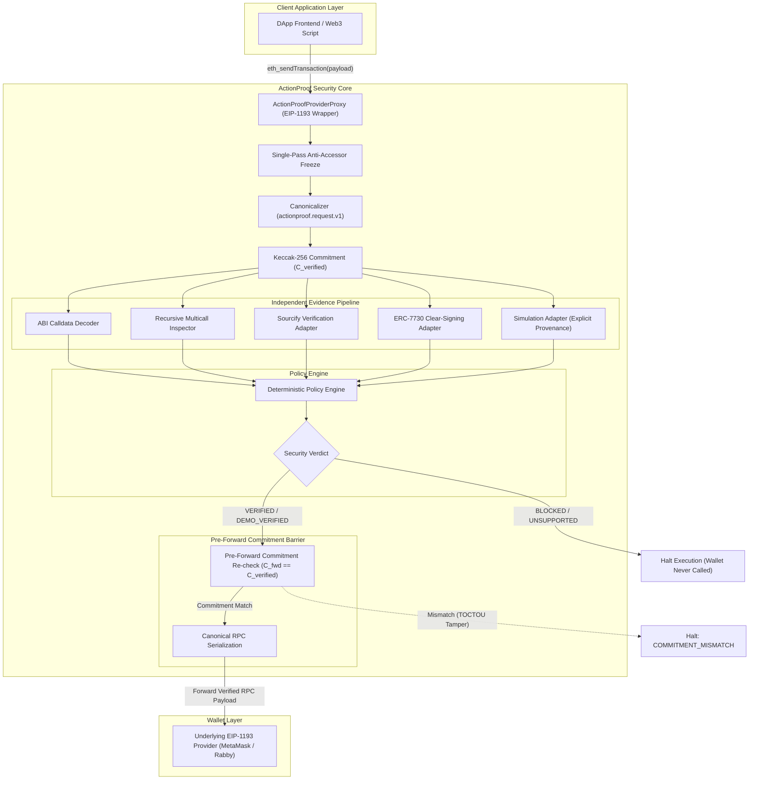

# ActionProof

> **Verify the transaction, not just the screen.**

[](https://www.typescriptlang.org/)
[]()
[]()
[]()
[](LICENSE)

**ActionProof** is a deterministic, pre-signing Ethereum security enforcement gate built at the **EIP-1193** provider boundary. It protects users from deceptive frontends, malicious calldata, stealth approvals, and in-memory parameter tampering before any authorization request reaches the wallet.

* **Hackathon Submission:** Crypto World's Fair 2026
* **Repository:** [https://github.com/Abhi010903/ActionProofETR](https://github.com/Abhi010903/ActionProofETR)
* **Security Level:** Level-2 Canonical Provider-Request Binding
* **Rule Engine:** 100% Deterministic — Zero Probabilistic LLM Authority

---

## Table of Contents

1. [The Problem: The Pre-Signing Authorization Gap](#1-the-problem-the-pre-signing-authorization-gap)
2. [The Solution: Machine-Verified Enforcement](#2-the-solution-machine-verified-enforcement)
3. [Key Features & Differentiation](#3-key-features--differentiation)
4. [Architecture & System Flow](#4-architecture--system-flow)
5. [How It Works: Normal Swap vs. Malicious Multicall](#5-how-it-works-normal-swap-vs-malicious-multicall)
6. [Level-2 Provider-Request Binding & Security Boundary](#6-level-2-provider-request-binding--security-boundary)
7. [Evidence Provenance: Production vs. Demo Fixtures](#7-evidence-provenance-production-vs-demo-fixtures)
8. [The 5 Evaluator Demo Scenarios](#8-the-5-evaluator-demo-scenarios)
9. [Interactive Security Console & Observability UX](#9-interactive-security-console--observability-ux)
10. [Technology Stack](#10-technology-stack)
11. [Quickstart: Setup, Run, and Test](#11-quickstart-setup-run-and-test)
12. [Automated Test Suite (218 Tests)](#12-automated-test-suite-218-tests)
13. [Limitations, Threat Model & Explicit Non-Claims](#13-limitations-threat-model--explicit-non-claims)
14. [Codebase Map & Subsystem Structure](#14-codebase-map--subsystem-structure)
15. [Project Status & Future Roadmap](#15-project-status--future-roadmap)
16. [Comprehensive Documentation Index](#16-comprehensive-documentation-index)

---

## 1. The Problem: The Pre-Signing Authorization Gap

In contemporary Web3 applications, irreversible cryptographic authorization decisions are routinely made based on unverified screen claims:

* **Deceptive Frontend UIs:** A DApp interface claims *"Swap 100 USDC for ETH"* while crafting calldata that transfers tokens to an attacker address.
* **Stealth Multicall Injections:** Legitimate interactions are bundled alongside unauthorized approvals (`token.approve(attacker, type(uint256).max)`) inside batch contracts (`Multicall3`, `SwapRouter02`).
* **In-Memory Post-Verification Mutation (TOCTOU):** Malicious browser scripts or extensions alter transaction parameters in JavaScript memory *after* security scanners examine them, but *before* the wallet receives the payload.
* **Calldata Opacity & Confirmation Fatigue:** Users are presented with raw hexadecimal strings, leading to habitual "Confirm" clicking.
* **Alternative Write Path Exploits:** Emerging transaction types (e.g. EIP-7702 delegation, blob transactions, account abstraction user operations) bypass naive pattern-matching scanners.

Existing wallet extensions act as passive visualizers or rely on non-deterministic LLMs. Neither architecture guarantees that the byte payload presented to the user corresponds cryptographically to what was analyzed.

---

## 2. The Solution: Machine-Verified Enforcement

**ActionProof** sits directly between the application and the user's Web3 wallet by wrapping the standard EIP-1193 provider (`window.ethereum`).

Instead of providing advisory warnings, ActionProof operates as an **active, fail-closed enforcement gate**:

1. **Anti-Accessor Freezing:** Intercepts `eth_sendTransaction`, reads properties in a single pass to neutralize malicious getter exploits, and recursively freezes an immutable snapshot.
2. **Canonical Commitment:** Normalizes transaction fields into a strict deterministic schema (`actionproof.request.v1`) and computes a cryptographic Keccak-256 commitment hash ($\mathcal{C}_{\text{verified}}$).
3. **Independent Evidence Pipeline:** Independently decodes calldata (including recursive multicall inspection), queries contract identity from Sourcify, checks clear-signing specifications via ERC-7730, and executes state simulation.
4. **Pure Deterministic Policy:** Evaluates machine-checked security rules—**zero LLM involvement**—to produce a verdict: `VERIFIED`, `DEMO_VERIFIED`, `WARNING`, `BLOCKED`, or `UNSUPPORTED`.
5. **Pre-Forward Commitment Barrier:** Immediately prior to dispatching to the wallet, ActionProof re-hashes the outgoing payload. If any field was mutated in memory ($\mathcal{C}_{\text{fwd}} \neq \mathcal{C}_{\text{verified}}$), **ActionProof halts execution and the wallet is never invoked.**

---

## 3. Key Features & Differentiation

| Capability | Standard Wallet / Security Extension | ActionProof Enforcement Gate |
|---|---|---|
| **Interception Point** | Passive visualizer / read-only advisor | In-line EIP-1193 wrapper gate |
| **Tamper Protection** | Vulnerable to in-memory JS mutation | Single-pass anti-accessor freeze + pre-forward commitment recheck |
| **Multicall Inspection** | Surface-level function decoding | Recursive multicall traversal & stealth approval detection |
| **Decision Authority** | Advisory warnings or probabilistic LLM | Pure mathematical deterministic policy rules |
| **Forwarding Guarantee** | Forwards whatever mutable memory holds | Derives forwarded RPC payload from verified canonical commitment |
| **Alternative Types** | May silently ignore unrecognized fields | Fails closed on EIP-7702, ERC-4337, and blobs (`UNSUPPORTED`) |
| **Evidence Provenance** | Obscures mock vs. live execution | Strictly separates `LIVE_*` external evidence from `LOCAL_FIXTURE` |

---

## 4. Architecture & System Flow


```mermaid
flowchart TD
    subgraph DApp["Client Application Layer"]
        App["DApp Frontend / Web3 Script"]
    end

    subgraph Core["ActionProof Security Core"]
        Proxy["ActionProofProviderProxy (EIP-1193 Wrapper)"]
        Snap["Single-Pass Anti-Accessor Freeze"]
        Canon["Canonicalizer (actionproof.request.v1)"]
        Commit["Keccak-256 Commitment (C_verified)"]

        subgraph Analysis["Independent Evidence Pipeline"]
            Dec["ABI Calldata Decoder"]
            Multi["Recursive Multicall Inspector"]
            Sourcify["Sourcify Verification Adapter"]
            ERC7730["ERC-7730 Clear-Signing Adapter"]
            Sim["Simulation Adapter (Explicit Provenance)"]
        end

        subgraph Decision["Policy Engine"]
            Policy["Deterministic Policy Engine"]
            Verdict{"Security Verdict"}
        end

        subgraph Barrier["Pre-Forward Commitment Barrier"]
            Recheck["Pre-Forward Commitment Re-check (C_fwd == C_verified)"]
            Derive["Canonical RPC Serialization"]
        end
    end

    subgraph Wallet["Wallet Layer"]
        Provider["Underlying EIP-1193 Provider (MetaMask / Rabby)"]
    end

    App -->|"eth_sendTransaction(payload)"| Proxy
    Proxy --> Snap
    Snap --> Canon
    Canon --> Commit
    Commit --> Dec & Multi & Sourcify & ERC7730 & Sim
    Dec & Multi & Sourcify & ERC7730 & Sim --> Policy
    Policy --> Verdict

    Verdict -->|"VERIFIED / DEMO_VERIFIED"| Recheck
    Verdict -->|"BLOCKED / UNSUPPORTED"| HaltProxy["Halt Execution (Wallet Never Called)"]

    Recheck -->|"Commitment Match"| Derive
    Recheck -.->|"Mismatch (TOCTOU Tamper)"| Abort["Halt: COMMITMENT_MISMATCH"]
    Derive -->|"Forward Verified RPC Payload"| Provider
```

---

## 5. How It Works: Normal Swap vs. Malicious Multicall

### Scenario A: Legitimate Uniswap V3 Swap
1. **Frontend Request:** DApp requests `eth_sendTransaction` calling Uniswap V3 `exactInputSingle` for 100 USDC $\rightarrow$ WETH.
2. **Snapshot & Commitment:** ActionProof captures `from`, `to`, `data`, `value`, `chainId`. Computes Keccak-256 commitment hash ($\mathcal{C}_{\text{verified}}$).
3. **Evidence Collection:**
   * Decoder identifies `exactInputSingle(params)` with recipient matching the router.
   * Sourcify adapter verifies router contract bytecode match.
   * ERC-7730 adapter validates clear-signing format against schema.
   * Simulation confirms balance deltas: `-100 USDC`, `+WETH`.
4. **Policy Decision:** All rules pass cleanly. Verdict: `VERIFIED` (in production mode) or `DEMO_VERIFIED` (in demo mode).
5. **Pre-Forward Barrier:** Validates outgoing commitment matches $\mathcal{C}_{\text{verified}}$, serializes canonical RPC payload, and forwards to wallet.

### Scenario B: Deceptive Multicall Attack (Hidden Unlimited Approval)
1. **Frontend Claim:** DApp UI states: *"Swap 100 USDC for ETH"*.
2. **Raw Calldata:** The frontend generates a `multicall` transaction containing two subcalls:
   * Subcall 1: Legitimate swap for 100 USDC.
   * Subcall 2: `approve(attackerAddress, 0xffffffffffffffffffffffffffffffffffffffffffffffffffffffffffffffff)`.
3. **Multicall Unrolling:** The recursive multicall inspector unpacks the subcall batch and identifies the hidden unlimited allowance.
4. **Policy Violation:**
   * `RULE_02A` triggers: Exact unlimited token approval ($2^{256} - 1$) detected.
   * `RULE_03` triggers: Dangerous subcall detected within multicall batch.
   * `RULE_04` triggers: Calldata contradicts declared application intent.
   * `RULE_09` triggers: Approval spender is an unbound third-party address.
5. **Enforcement:** ActionProof issues verdict **`BLOCKED`**. The transaction promise rejects immediately. **The wallet confirmation screen is never triggered.**

---

## 6. Level-2 Provider-Request Binding & Security Boundary

ActionProof defines transaction authorization security across three precise architectural levels:

```
+-------------------------------------------------------------------------------+
| Level 1: Semantic Request Identity                                            |
| Parses to, data, value, chainId. Advisory only; vulnerable to in-memory TOCTOU.|
+-------------------------------------------------------------------------------+
                                        |
                                        v
+-------------------------------------------------------------------------------+
| Level 2: Canonical Provider Request Binding  [ ACTIONPROOF MVP GUARANTEE ]    |
| Invariant: Forwarded request is canonical-equivalent to verified request.     |
| Enforced by synchronous pre-forward cryptographic commitment barrier.        |
+-------------------------------------------------------------------------------+
                                        |
                                        v
+-------------------------------------------------------------------------------+
| Level 3: Final Wallet Signing Payload Binding  [ OUTSIDE MVP SCOPE ]          |
| Invariant: Raw RLP bytes signed by secure enclave match verified request.    |
| Requires wallet-internal firmware integration; honestly marked OUTSIDE MVP.  |
+-------------------------------------------------------------------------------+
```

### The Formal Level-2 Guarantee
> *"Within an integration where ActionProof owns the EIP-1193 provider path to the wallet, the immutable forwarded transaction request is canonical-equivalent to the request whose commitment was verified under the `actionproof.request.v1` schema."*

Mathematically enforced at the barrier:
$$\forall T \in \text{Transactions}, \quad \text{Dispatch}(T_{\text{fwd}}) \iff \mathcal{H}(\mathcal{N}(T_{\text{fwd}})) \equiv \mathcal{C}_{\text{verified}}$$

If $\mathcal{H}(\mathcal{N}(T_{\text{fwd}})) \neq \mathcal{C}_{\text{verified}}$, the pre-forward barrier aborts with `COMMITMENT_MISMATCH` and the wallet provider receives **0** calls.

---

## 7. Evidence Provenance: Production vs. Demo Fixtures

ActionProof strictly enforces honesty in all evidence claims:

| Provenance Label | Meaning | Production Policy Impact | Demo Policy Impact |
|---|---|---|---|
| `LIVE_EXTERNAL` | Obtained from successful, validated external HTTP response (e.g. Sourcify API). | Eligible for `VERIFIED` | Eligible for `VERIFIED` |
| `LIVE_REGISTRY` | Retrieved from genuine external ERC-7730 registry endpoint. | Eligible for `VERIFIED` | Eligible for `VERIFIED` |
| `LIVE_BACKEND` | Successfully executed via live JSON-RPC `eth_call` on an aligned block. | Eligible for `VERIFIED` | Eligible for `VERIFIED` |
| `LOCAL_FIXTURE` | In-memory mock or demonstration fixture. | **Degrades to `WARNING`** (Cannot achieve `VERIFIED`) | Yields **`DEMO_VERIFIED`** |
| `NONE` / `UNAVAILABLE` | Endpoint missing, offline, timed out, or unverified. | Degrades to **`WARNING`** | Degrades to **`WARNING`** |

> [!IMPORTANT]
> **`DEMO_VERIFIED` is NOT production `VERIFIED`.**
> `DEMO_VERIFIED` honestly indicates that the transaction satisfied policy rules using deterministic **local demo fixtures**. It is not proof of live blockchain state or transaction safety on mainnet. Production `VERIFIED` requires live external evidence adapters via `createLiveEvidencePipeline()`.

---

## 8. The 5 Evaluator Demo Scenarios

The test console demonstrates 5 evaluator scenarios:

| # | Scenario | DApp UI Claim | Calldata Semantics | Policy Verdict | Barrier Status | Forwarded to Wallet? |
|---|---|---|---|---|---|---|
| **1** | **Normal Supported Swap** | *"Swap 100 USDC for ETH on Uniswap V3"* | Valid `exactInputSingle` parameters | **`DEMO_VERIFIED`** *(or `VERIFIED` in live mode)* | Matches ($\mathcal{C}_{\text{fwd}} = \mathcal{C}_{\text{verified}}$) | **YES (1 call)** |
| **2** | **Hidden Unlimited Approval** | *"Swap 100 USDC for ETH"* | `multicall` with hidden `approve(attacker, MAX_UINT)` | **`BLOCKED`** | Blocked at policy stage | **NO (0 calls)** |
| **3** | **Post-Verification Mutation** | *"Swap 100 USDC for ETH"* | Valid calldata, but `to` mutated in memory post-scan | **`COMMITMENT_MISMATCH`** | **Barrier Tripped!** ($\mathcal{C}_{\text{fwd}} \neq \mathcal{C}_{\text{verified}}$) | **NO (0 calls)** |
| **4** | **Unknown Calldata** | *"Claim Staking Rewards"* | Unrecognized selector `0x12345678...` | **`BLOCKED`** (`UNKNOWN_CALLDATA`) | Blocked at policy stage | **NO (0 calls)** |
| **5** | **Unsupported Type (EIP-7702)** | *"Delegate Account Execution"* | Type-4 transaction with `authorizationList` | **`UNSUPPORTED`** | Blocked at schema validation | **NO (0 calls)** |

---

## 9. Interactive Security Console & Observability UX

ActionProof includes an evaluator dashboard built with React:

* **Staged Unexecuted State (`READY`):** Selecting a scenario prepares the payload without auto-executing. The Staged Request Preview renders with state `READY`.
* **Explicit Execution Gate:** Clicking **`🛡️ Intercept & Verify Request`** dispatches the request through the live `ActionProofProviderProxy`.
* **Live Telemetry:** Displays browser timestamps and a monotonic execution counter (`Execution #1`, `Execution #2`).
* **Visual Commitment Barrier:** In Scenario 3, a dedicated barrier alert displays the verified commitment hash side-by-side with the tampered post-verification hash.
* **Deterministic Reset:** Clicking **`🔄 Reset Demo State`** clears mock wallet logs and resets the console.

---

## 10. Technology Stack

* **Language:** TypeScript 5.7 (Strict mode, zero `any` bypasses in security core)
* **Build System:** Vite 5.4
* **Testing Framework:** Vitest 2.1 (Hermetic, deterministic test execution)
* **Cryptography & Encoding:** `viem` 2.56 (Keccak-256, ABI decoding, hex utilities)
* **User Interface:** React 19, Lucide React
* **Deployment Model:** In-process client-side library (zero backend dependencies)

---

## 11. Quickstart: Setup, Run, and Test

### Prerequisites
* **Node.js:** v18.0.0 or higher
* **npm:** v9.0.0 or higher

### 1. Clone & Install
```bash
git clone https://github.com/Abhi010903/ActionProofETR.git
cd ActionProofETR
npm install
```

### 2. Verify Repository Health (Automated Triad)
```bash
# Type check: 0 errors
npx tsc --noEmit

# Test suite: 218 tests passing across 7 files
npm test

# Production build: clean hermetic compilation
npm run build
```

### 3. Launch the Interactive Demo Console
```bash
npm run dev
```
Open **`http://localhost:5173`** in your browser to run the 5 evaluator scenarios.

---

## 12. Automated Test Suite (218 Tests)

The test suite covers 218 deterministic test cases across 7 suites:

```text
 ✓ tests/canonical/canonical.test.ts          (22 tests)
 ✓ tests/policy/policy.test.ts                (65 tests)
 ✓ tests/analysis/multicall.test.ts            (9 tests)
 ✓ tests/integration/end-to-end.test.ts        (7 tests)
 ✓ tests/ui/demo-observability.test.ts         (6 tests)
 ✓ tests/provider/provider-binding.test.ts   (104 tests)
 ✓ tests/analysis/evidence-honesty.test.ts     (5 tests)

Test Files  7 passed (7)
     Tests  218 passed (218)
```

### Coverage Highlights:
* **Provider Binding (`provider-binding.test.ts` — 104 tests):** Tests 1–12 formal specifications, single-pass getter disarming, in-flight mutation detection, circular reference rejection, `accessList` isolation, chain ID sync, canonical RPC forwarding, fail-closed transport isolation, and adversarial provenance verification.
* **Policy Engine (`policy.test.ts` — 65 tests):** Deterministic policy evaluation, `RULE_04` intent contradiction matrix, fail-closed unknown calldata, decimal-aware approval thresholds, recipient integrity, and provenance degradation.
* **Canonical Normalization (`canonical.test.ts` — 22 tests):** Schema whitelisting, address lowercasing, quantity trimming, access list sorting, and serialization determinism under `actionproof.request.v1`.
* **Multicall Analysis (`multicall.test.ts` — 9 tests):** Recursive multicall unrolling (up to 3 levels deep), stealth approval isolation, and threshold boundaries.
* **Integration E2E (`end-to-end.test.ts` — 7 tests):** Full pipeline flows for normal swaps, attacks, mutations, unknown calldata, EIP-7702 delegation, and live pipelines.
* **Evidence Honesty (`evidence-honesty.test.ts` — 5 tests):** Simulation provenance (`LOCAL_FIXTURE` vs `LIVE_EXTERNAL`), Sourcify and ERC-7730 honest labeling.
* **Demo Observability (`demo-observability.test.ts` — 6 tests):** UI state machine transitions, timestamp captures, execution counts, and reset behavior.

---

## 13. Limitations, Threat Model & Explicit Non-Claims

ActionProof adheres to strict security honesty:

1. **Level-3 Signing Binding is Outside MVP Scope:** ActionProof enforces Level-2 Request Binding across the EIP-1193 interface. It cannot verify what a wallet's hardware enclave or firmware signs internally.
2. **Smart Contract Logic Bugs:** ActionProof decodes calldata and verifies contract identity, but cannot prevent economic failure (e.g. reentrancy or oracle manipulation) in verified contracts.
3. **Mempool TOCTOU:** Mempool front-running and state changes between simulation and block inclusion are inherent to public blockchains.
4. **Direct Provider Bypass:** If malicious code connects directly to external RPC endpoints without calling `window.ethereum`, an in-process provider proxy cannot intercept it.
5. **Unsupported Types Fail Closed:** Modern alternative write paths fail closed with `UNSUPPORTED`:
   * **ERC-4337:** `eth_sendUserOperation` is blocked at proxy boundary.
   * **EIP-7702:** `authorizationList` is rejected at schema validation.
   * **EIP-5792:** `wallet_sendCalls` is blocked as an unsupported method.
   * **EIP-4844:** Blob transactions are rejected at schema validation.
   * **Off-Chain Signatures:** `eth_signTypedData` and Permit/Permit2 signatures are out of MVP transaction scope.

---

## 14. Codebase Map & Subsystem Structure

```text
ActionProof/
├── docs/                                  # Comprehensive Documentation (12 Guides)
│   ├── 01-PROBLEM.md                      # Problem definition & Web3 pre-signing gap
│   ├── 02-SOLUTION.md                     # 4 core security questions & solution model
│   ├── 03-ARCHITECTURE.md                 # Subsystem hierarchy & in-process execution
│   ├── 04-SECURITY-MODEL.md               # Trust boundaries, Level 1-3, fail-closed
│   ├── 05-RUNTIME-FLOW.md                 # 9-stage transaction lifecycle & sequence
│   ├── 06-THREAT-MODEL.md                 # Threat matrix & attack-defense hierarchy
│   ├── 07-EVIDENCE-PIPELINE.md            # Evidence adapters & honest provenance
│   ├── 08-PROVIDER-BINDING.md             # Level-2 binding invariant & pre-forward barrier
│   ├── 09-DEMO-SCENARIOS.md               # 5 evaluator demo scenarios & execution matrix
│   ├── 10-LIMITATIONS.md                  # Scope boundaries & explicit non-claims
│   ├── 11-TECHNICAL-DEEP-DIVE.md          # Canonicalization, freezing & determinism
│   └── 12-EVALUATOR-GUIDE.md              # 5-minute evaluator quickstart guide
│
├── src/                                   # Security Core & Implementation
│   ├── canonical/                         # Normalization, schema & Keccak-256 commitments
│   │   ├── types.ts                       # actionproof.request.v1 schema types
│   │   ├── schema.ts                      # Strict schema & type compatibility validation
│   │   ├── normalize.ts                   # Address, quantity, accessList normalizers
│   │   ├── serializer.ts                  # Deterministic fixed-order JSON serializer
│   │   └── commitment.ts                  # Canonicalization & Keccak-256 commitment hasher
│   │
│   ├── provider/                          # EIP-1193 Provider Proxy & Enforcement
│   │   ├── types.ts                       # Provider, barrier & verification result types
│   │   ├── proxy.ts                       # ActionProofProviderProxy & pre-forward recheck
│   │   ├── snapshot.ts                    # Single-pass getter disarming & deep freeze
│   │   ├── barrier.ts                     # Deterministic synchronization barrier
│   │   ├── eip1193.ts                     # Standard EIP-1193 interface definitions
│   │   └── mockWallet.ts                  # Deterministic test wallet provider
│   │
│   ├── analysis/                          # Independent Calldata Analysis
│   │   ├── decoder.ts                     # Trusted interface ABI decoder
│   │   ├── multicall.ts                   # Recursive multicall & approval inspector
│   │   ├── contract.ts                    # Sourcify contract identity verification
│   │   └── simulation.ts                  # State simulation with explicit provenance
│   │
│   ├── intent/                            # Intent Evidence & Matching
│   │   ├── erc7730.ts                     # ERC-7730 clear-signing format adapter
│   │   ├── intent-provider.ts             # Application intent capture interface
│   │   └── structured.ts                  # Structured intent definitions & categories
│   │
│   ├── evidence/                          # Multi-Source Evidence Pipeline
│   │   ├── types.ts                       # CompleteEvidence & evidence bundle schemas
│   │   └── pipeline.ts                    # EvidencePipeline aggregator & coordinator
│   │
│   ├── policy/                            # Deterministic Policy Engine
│   │   ├── rules.ts                       # Deterministic rules (RULE_01-09) & contradiction detector
│   │   └── engine.ts                      # DeterministicPolicyEngine evaluator
│   │
│   └── ui/                                # Evaluator Security Console
│       ├── App.tsx                        # Main React security dashboard
│       ├── runner.ts                      # DemoRunner execution state machine
│       ├── scenarios.ts                   # Evaluator scenario fixtures
│       ├── main.tsx                       # React application entrypoint
│       └── styles.css                     # Terminal UI styling
│
└── tests/                                 # Deterministic Automated Test Suite (218 tests)
    ├── canonical/                         # Normalization & schema tests (22 tests)
    ├── provider/                          # Provider binding & mutation tests (104 tests)
    ├── analysis/                          # Multicall & evidence honesty tests (14 tests)
    ├── policy/                            # Policy determinism & RULE_04 tests (65 tests)
    ├── integration/                       # End-to-end scenario tests (7 tests)
    └── ui/                                # Demo observability tests (6 tests)
```

---

## 15. Project Status & Future Roadmap

* **Current Status:** Level-2 Provider-Request Binding fully implemented, frozen, and verified across 218 test cases.
* **Roadmap Ahead:**
  * **Level-3 Wallet Firmware Integration:** Collaborate with wallet vendors to bind verified commitments directly into hardware enclave signing payloads.
  * **Live Archive Simulation:** Connect live simulation adapters to `debug_traceCall` archive nodes.
  * **EIP-7702 Delegation Validation:** Implement canonical validation for `authorizationList` signatures and delegation targets.
  * **EIP-5792 Support:** Extend canonical normalization to support `wallet_sendCalls` batch transactions.

---

## 16. Comprehensive Documentation Index

For technical depth, consult the dedicated guides in [`docs/`](docs/):

* [**01. Problem Definition**](docs/01-PROBLEM.md) — The Web3 pre-signing vulnerability gap and failure modes.
* [**02. Solution Architecture**](docs/02-SOLUTION.md) — The 4 core security questions and pre-signing enforcement paradigm.
* [**03. Subsystem Architecture**](docs/03-ARCHITECTURE.md) — Component hierarchy, in-process model, and subsystem breakdown.
* [**04. Security Model**](docs/04-SECURITY-MODEL.md) — Trust assumptions, Level 1–3 distinctions, and fail-closed posture.
* [**05. Runtime Flow**](docs/05-RUNTIME-FLOW.md) — 9-stage transaction lifecycle and sequence diagram.
* [**06. Threat Model**](docs/06-THREAT-MODEL.md) — Adversary threat matrix and attack-defense hierarchy.
* [**07. Evidence Pipeline**](docs/07-EVIDENCE-PIPELINE.md) — ABI decoding, multicall unrolling, and honest provenance tracking.
* [**08. Provider Binding**](docs/08-PROVIDER-BINDING.md) — Level-2 binding invariant, anti-accessor hardening, and barrier code.
* [**09. Demo Scenarios**](docs/09-DEMO-SCENARIOS.md) — The 5 evaluator demo scenarios and execution matrix.
* [**10. Scope & Limitations**](docs/10-LIMITATIONS.md) — MVP boundary, explicit non-claims, and future roadmap.
* [**11. Technical Deep Dive**](docs/11-TECHNICAL-DEEP-DIVE.md) — Canonicalization rules, freezing algorithms, and hashing.
* [**12. Evaluator Quickstart**](docs/12-EVALUATOR-GUIDE.md) — 5-minute testing guide for hackathon evaluators.

---

## License

This project is licensed under the MIT License — see the [LICENSE](LICENSE) file for details.
