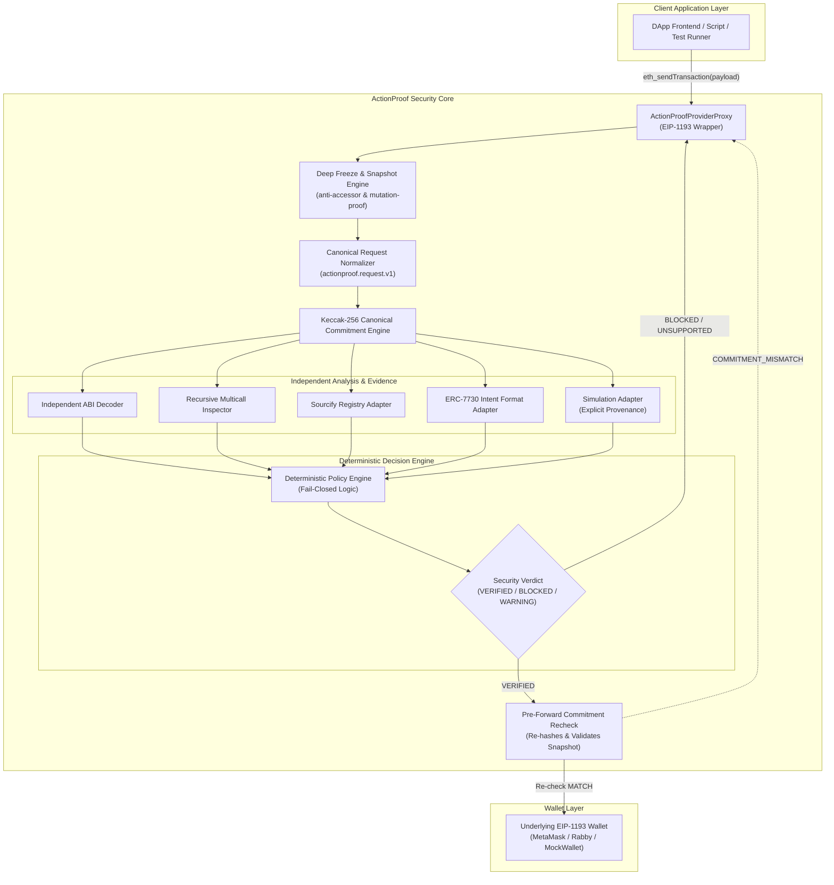

# ActionProof — Subsystem Architecture & Component Hierarchy

## 1. High-Level Architecture Diagram



---

## 2. In-Process Client-Side Execution Model

ActionProof is designed as an **in-process, zero-network-dependency security library and proxy**. 

* **No Backend Server Required:** ActionProof does not rely on a centralized API, cloud scanner, or off-chain oracle to perform transaction interception and policy enforcement.
* **Direct Provider Wrapping:** Any standard EIP-1193 provider (e.g. `window.ethereum`) is wrapped via:
  ```typescript
  const secureProvider = new ActionProofProviderProxy(underlyingProvider, options);
  ```
* **Thread-Isolated Execution:** The snapshotting, normalization, decoding, and policy evaluation occur synchronously within the client runtime before the asynchronous forwarding promise is invoked.

---

## 3. Subsystem Breakdown

### 3.1. Canonical Normalization & Commitment (`src/canonical/`)
* **`types.ts`**: Defines the canonical representation under domain `actionproof.request.v1`. Contains exact field types for `to`, `from`, `data`, `value`, `chainId`, `nonce`, `gas`, `gasPrice`, `maxFeePerGas`, `maxPriorityFeePerGas`, and `accessList`.
* **`schema.ts`**: Validates request structure and enforces the strict supported key whitelist (`SUPPORTED_KEYS`), rejecting unknown properties and unsupported protocols (EIP-7702, blobs).
* **`normalize.ts`**: Performs strict normalization: converts addresses to lowercase `0x` hex, standardizes quantities, normalizes calldata (`0x` if empty), and sorts access list entries.
* **`serializer.ts`**: Deterministically serializes the canonical request into a fixed-order JSON string.
* **`commitment.ts`**: Computes canonicalization and generates Ethereum Keccak-256 commitments via `viem` (`keccak256(stringToBytes(serialized))`).

### 3.2. Provider Interception & Barrier (`src/provider/`)
* **`proxy.ts`**: Implements the EIP-1193 interface (`request()`). Intercepts `eth_sendTransaction`, runs the ActionProof pipeline, and enforces pre-forward commitment rechecks in-line via `executeSendTransaction()`. Non-transaction RPC calls are passed through transparently.
* **`barrier.ts`**: Implements `DeterministicBarrier` used in test harnesses for non-timing-dependent mutation testing (e.g. Test 7).
* **`snapshot.ts`**: Implements recursive deep freezing (`createImmutableSnapshot`), disarming hostile getters and isolating transaction parameters from heap mutation.
* **`eip1193.ts`**: Defines EIP-1193 provider interfaces, errors, and provides the test `MockWalletProvider`.

### 3.3. Transaction Decoding & Analysis (`src/analysis/`)
* **`decoder.ts`**: Independently parses calldata against built-in interfaces (`KNOWN_ERC20_ABI`, `KNOWN_SWAP_ABI`) without relying on DApp-provided ABIs. Classifies approvals into `EXACT_UNLIMITED`, `HIGH_VALUE_APPROVAL`, or `STANDARD`.
* **`multicall.ts`**: Recursively unpacks batched transactions (`multicall`, `aggregate`, `aggregate3`). Traverses nested byte arrays down to the recursion limit.
* **`contract.ts`**: Sourcify contract source correspondence adapter with explicit provenance tracking (`LOCAL_FIXTURE` vs `LIVE_EXTERNAL`).
* **`simulation.ts`**: Single-block EVM execution simulation adapter predicting balance deltas and state context with explicit provenance and TOCTOU notices.

### 3.4. Clear Signing & Intent (`src/intent/`)
* **`erc7730.ts`**: Parses ERC-7730 v2 clear signing metadata to cross-validate calldata parameters against human-readable intent schemas.
* **`intent-provider.ts`**: Abstract interface for clear signing descriptors.

### 3.5. Evidence Model (`src/evidence/`)
* **`pipeline.ts`**: Orchestrates evidence collection across decoding, Sourcify, ERC-7730, and simulation into `CompleteEvidence`.
* **`types.ts`**: Type definitions for multi-source structured evidence.

### 3.6. Policy & Decision Engine (`src/policy/`)
* **`engine.ts`**: `DeterministicPolicyEngine` evaluates evidence against deterministic rules, outputting `VERIFIED`, `WARNING`, `BLOCKED`, or `UNSUPPORTED`.
* **`rules.ts`**: 9 deterministic security rules:
  * `RULE_01_REQUEST_BINDING`: Fails closed on commitment mismatch.
  * `RULE_02A_NO_EXACT_UNLIMITED_APPROVALS`: Blocks `type(uint256).max` approvals.
  * `RULE_02B_HIGH_VALUE_APPROVAL_CHECK`: Enforces policy on approvals $\ge 10^{30}$.
  * `RULE_03_MULTICALL_CALL_INTEGRITY`: Blocks unexpected dangerous actions inside multicall batches.
  * `RULE_04_APPLICATION_INTENT_ALIGNMENT`: Deterministic contradiction detector between declared intent and decoded call tree.
  * `RULE_05_SIMULATION_EXECUTION`: Checks simulation reverts and unavailable status.
  * `RULE_06_CONTRACT_CORRESPONDENCE`: Checks Sourcify verification.
  * `RULE_07_CLEAR_SIGNING_DESCRIPTOR`: Cross-validates ERC-7730 descriptors.
  * `RULE_08_CALLDATA_DECODING_STATUS`: Fails closed on un-decodable calldata selectors.

### 3.6. User Interface & Observability (`src/ui/`)
* **`App.tsx`**: React dashboard displaying the live transaction verification pipeline, evidence traces, and mock wallet balance state.
* **`runner.ts` (`DemoRunner`)**: Manages the deterministic execution lifecycle (`READY` $\rightarrow$ `RUNNING` $\rightarrow$ `COMPLETED`), maintaining an explicit execution counter and real runtime timestamp.
