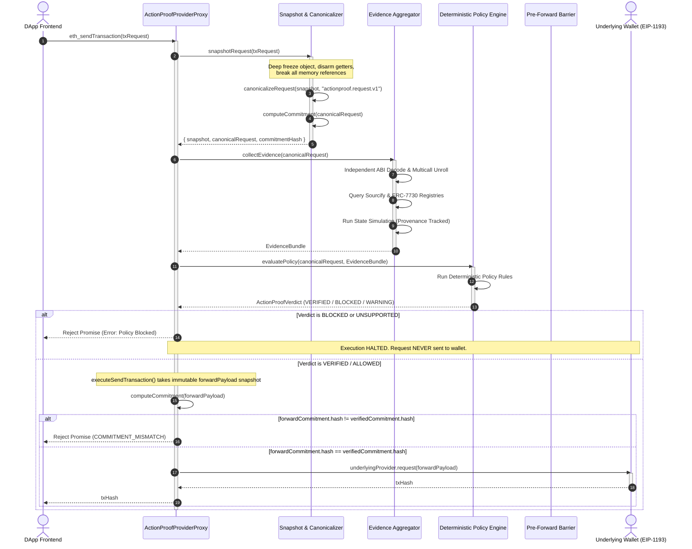

# ActionProof — Detailed Runtime Verification Flow

## 1. Runtime Sequence Diagram



---

## 2. The Nine Execution Stages

### Stage 1: Interception at the EIP-1193 Boundary
When a decentralized application calls:
```typescript
window.ethereum.request({
  method: "eth_sendTransaction",
  params: [transactionPayload]
});
```
`ActionProofProviderProxy` intercepts the method call. Non-transaction RPC queries (e.g. `eth_accounts`, `eth_chainId`, `eth_blockNumber`) pass directly through to the underlying provider without interception overhead.

### Stage 2: In-Memory Deep Freezing & Anti-Accessor Disarmament
The transaction payload is untrusted. Malicious scripts can pass Proxy objects or objects with dynamic getters that return benign values during verification and malicious values during forwarding:
```typescript
// Attacker's getter trap
let accessCount = 0;
const maliciousPayload = {
  get to() {
    return accessCount++ === 0 ? "0xBenignContract" : "0xAttackerAddress";
  },
  data: "0x..."
};
```
ActionProof traverses the payload, executes getters once during initial capture, clones primitive values into a clean dictionary, and calls `Object.freeze()` recursively. The original object reference is discarded.

### Stage 3: Canonical Normalization (`actionproof.request.v1`)
The frozen snapshot is normalized according to strict rules:
* Addresses (`to`, `from`) are lowercased and verified to be 40-character hex strings with `0x` prefix.
* Values and gas figures are converted to normalized hex representations without unnecessary leading zeros.
* Calldata is normalized (`0x` if empty).
* `accessList` items are deterministically sorted by address and storage keys.
* Unsupported fields (such as `authorizationList` or `blobs`) are flagged immediately.

### Stage 4: Cryptographic Commitment Generation
The normalized canonical object is serialized into a deterministic byte sequence (fixed schema key order) and hashed via Ethereum Keccak-256 using `viem` `keccak256(stringToBytes(serialized))`:
$$\text{Commitment} = \text{Keccak256}(\text{FixedOrderJSON}(\text{CanonicalRequest}))$$
This commitment acts as an unforgeable fingerprint under the `actionproof.request.v1` schema domain.

### Stage 5: Independent Evidence Aggregation
ActionProof dispatches parallel independent analysis pipelines:
* **ABI Decoding (`src/analysis/decoder.ts`):** Inspects function selectors against verified ERC-20 and DEX interfaces (`KNOWN_ERC20_ABI`, `KNOWN_SWAP_ABI`).
* **Multicall Unrolling (`src/analysis/multicall.ts`):** Recursively decodes nested call arrays down to depth limits, surfacing approvals or dangerous subcalls.
* **Registry Lookup (`src/analysis/contract.ts`):** Verifies contract source authenticity via Sourcify metadata with explicit provenance tracking (`LOCAL_FIXTURE`).
* **ERC-7730 Parsing (`src/intent/erc7730.ts`):** Matches function arguments against clear-signing intent schemas.
* **Simulation Adapter (`src/analysis/simulation.ts`):** Simulates state transitions and records balance deltas, annotating the result with honest provenance (`LOCAL_FIXTURE` vs `LIVE_BACKEND` or `UNAVAILABLE`).

### Stage 6: Intent-to-Request Contradiction Analysis (`RULE_04`)
The verified machine-checked operations across the top-level call and recursive call tree are evaluated against the DApp's declared action. If the frontend claims a swap (`SWAP`) but calldata executes `approve`, `transfer`, or `transferFrom`, or if `TRANSFER`/`SEND`/`PAYMENT` is claimed while executing `approve` or `swap`, or `APPROVAL` claimed while executing `swap` or `transfer`, a fatal contradiction is flagged. Matching actions pass cleanly, unmodeled actions (`CLAIM` + `transferFrom`) remain outside the contradiction matrix without claiming verified alignment, and custom UI language passes without claiming verified intent. This is pure deterministic string/category matching—zero NLP or LLM inference.

### Stage 7: Deterministic Policy Evaluation
The Policy Engine evaluates all evidence against deterministic rules:
* `RULE_01_REQUEST_BINDING`: Fails closed on commitment mismatch.
* `RULE_02A_NO_EXACT_UNLIMITED_APPROVALS`: Blocks `type(uint256).max` approvals.
* `RULE_02B_HIGH_VALUE_APPROVAL_CHECK`: Enforces policy on approvals $\ge 10^{30}$.
* `RULE_03_MULTICALL_CALL_INTEGRITY`: Blocks unexpected dangerous actions inside multicall batches.
* `RULE_04_APPLICATION_INTENT_ALIGNMENT`: Enforces deterministic alignment between declared intent and decoded call tree.
* `RULE_05_SIMULATION_EXECUTION`: Blocks on EVM reverts; warns on unavailable simulation.
* `RULE_06_CONTRACT_CORRESPONDENCE`: Warns on unverified contracts.
* `RULE_07_CLEAR_SIGNING_DESCRIPTOR`: Blocks on ERC-7730 descriptor mismatches.
* `RULE_08_CALLDATA_DECODING_STATUS`: Fails closed on unknown calldata selectors.

### Stage 8: Pre-Forward Commitment Recheck
If initial policy checks pass (`VERIFIED`), execution reaches the pre-forward recheck in `ActionProofProviderProxy.executeSendTransaction()`. An immutable snapshot of the outgoing payload is created (`createImmutableSnapshot`), canonicalized, and re-hashed using Keccak-256.
If `forwardCommitment.hash !== verifiedCommitment.hash`, execution halts immediately with `COMMITMENT_MISMATCH` before the wallet provider is ever invoked.

### Stage 9: Forwarding or Fail-Closed Blocking
* **If Approved & Verified:** The request is forwarded to the underlying wallet, which prompts the user.
* **If Blocked or Mismatched:** The promise is rejected immediately. The underlying wallet never receives the call, preventing user error and confirmation fatigue.
