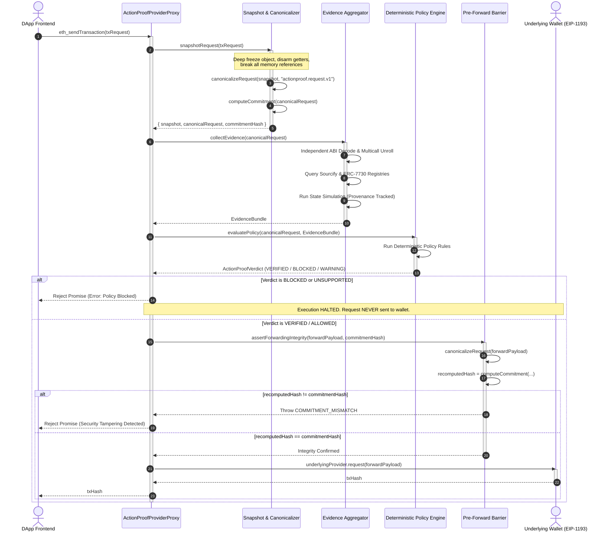

# ActionProof — Detailed Runtime Verification Flow

## 1. Runtime Sequence Diagram



---

## 2. The Nine Execution Stages

### Stage 1: Interception at the EIP-1193 Boundary
When a decentralized application calls:
```typescript
window.ethereum.request({
  method: "eth_sendTransaction",
  params: [transactionPayload]
});
```
`ActionProofProviderProxy` intercepts the method call. Non-transaction RPC queries (e.g. `eth_accounts`, `eth_chainId`, `eth_blockNumber`) pass directly through to the underlying provider without interception overhead.

### Stage 2: In-Memory Deep Freezing & Anti-Accessor Disarmament
The transaction payload is untrusted. Malicious scripts can pass Proxy objects or objects with dynamic getters that return benign values during verification and malicious values during forwarding:
```typescript
// Attacker's getter trap
let accessCount = 0;
const maliciousPayload = {
  get to() {
    return accessCount++ === 0 ? "0xBenignContract" : "0xAttackerAddress";
  },
  data: "0x..."
};
```
ActionProof traverses the payload, executes getters once during initial capture, clones primitive values into a clean dictionary, and calls `Object.freeze()` recursively. The original object reference is discarded.

### Stage 3: Canonical Normalization (`actionproof.request.v1`)
The frozen snapshot is normalized according to strict rules:
* Addresses (`to`, `from`) are lowercased and verified to be 40-character hex strings with `0x` prefix.
* Values and gas figures are converted to normalized hex representations without unnecessary leading zeros.
* Calldata is normalized (`0x` if empty).
* `accessList` items are deterministically sorted by address and storage keys.
* Unsupported fields (such as `authorizationList` or `blobs`) are flagged immediately.

### Stage 4: Cryptographic Commitment Generation
The normalized canonical object is serialized into a deterministic byte sequence (sorted keys, consistent whitespace) and hashed via SHA-256:
$$\text{Commitment} = \text{SHA256}(\text{DeterministicJSON}(\text{CanonicalRequest}))$$
This commitment acts as an unforgeable fingerprint of the verified parameters.

### Stage 5: Independent Evidence Aggregation
ActionProof dispatches parallel independent analysis pipelines:
* **ABI Decoding:** Inspects function selectors against verified ERC-20 and DEX interfaces.
* **Multicall Unrolling:** Recursively decodes nested call arrays, exposing hidden approvals or transfers.
* **Registry Lookup:** Verifies contract source authenticity via Sourcify metadata.
* **ERC-7730 Parsing:** Matches function arguments against clear-signing intent schemas.
* **Simulation Adapter:** Simulates state transitions and records balance deltas, annotating the result with honest provenance (`LOCAL_FIXTURE` vs `LIVE_RPC`).

### Stage 6: Intent-to-Request Binding Analysis
The verified machine-checked operations are compared against the DApp's untrusted client claim. If the frontend claims a simple swap but the calldata contains an additional unlimited token approval, an intent mismatch is registered.

### Stage 7: Deterministic Policy Evaluation
The Policy Engine evaluates all evidence against deterministic rules:
* `StealthApprovalRule`: Rejects unexpected approvals inside multicalls.
* `CalldataIntegrityRule`: Fails closed on unknown calldata selectors.
* `UnsupportedTypeRule`: Rejects unsupported EIP-7702 or blob transactions.
* `CommitmentIntegrityRule`: Rejects mutated payloads.

### Stage 8: Pre-Forward Commitment Barrier
If the policy engine grants approval (`VERIFIED`), the pre-forward barrier intercepts the outgoing dispatch. It takes the exact object passed to `underlyingProvider.request()`, normalizes it, and re-computes its SHA-256 commitment.
If the recomputed hash does not match the verified hash, execution halts with `COMMITMENT_MISMATCH`.

### Stage 9: Forwarding or Fail-Closed Blocking
* **If Approved & Verified:** The request is forwarded to the underlying wallet, which prompts the user.
* **If Blocked or Mismatched:** The promise is rejected immediately. The underlying wallet never receives the call, preventing user error and confirmation fatigue.
