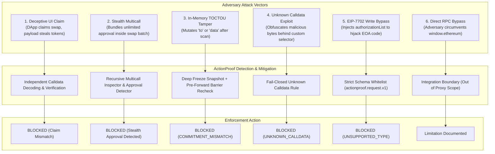

# ActionProof — Threat Model & Attack Matrix

## 1. Attack-Defense Hierarchy Diagram

---

## 2. Threat Matrix

| Threat ID | Threat Name | Adversary Technique | ActionProof Defense Mechanism | Severity | Outcome |
| :--- | :--- | :--- | :--- | :--- | :--- |
| **THREAT-01** | **UI Deception / Intent Contradiction** | Compromised frontend renders "Swap 100 USDC -> ETH" while calldata executes `approve(attacker, ...)` or `transfer(...)`. | Evaluates declared intent categories (`SWAP`, `TRANSFER`, `SEND`, `PAYMENT`, `APPROVAL`, `CLAIM`) against decoded action categories (`APPROVE`, `TRANSFER`, `TRANSFER_FROM`, `SWAP`, `UNKNOWN`) via deterministic `RULE_04`. Contradictions fail closed. | Critical | **BLOCKED (Deceptive UI Claim)** |
| **THREAT-02** | **Stealth Multicall Approval** | Attacker batches a normal swap with `token.approve(attacker, MAX_UINT256)` inside `Multicall3.aggregate3`. | Multicall engine recursively unpacks nested call array. Policy engine (`RULE_02A`, `RULE_03`, `RULE_04`) detects unannounced approval and dangerous subcalls. | Critical | **BLOCKED** |
| **THREAT-03** | **Post-Verification Mutation (TOCTOU)** | Hostile script modifies `tx.to` in the JavaScript heap after policy check passes, before wallet receives request. | In-line pre-forward recheck in `executeSendTransaction()` takes immutable snapshot, re-canonicalizes, and verifies $\mathcal{C}_{\text{fwd}} \equiv \mathcal{C}_{\text{verified}}$ via Keccak-256. | Critical | **COMMITMENT_ MISMATCH (BLOCKED)** |
| **THREAT-04** | **Getter / Proxy Trap Manipulation** | Attacker passes object with getter returning benign value on read #1 (scanner) and malicious value on read #2 (wallet). | `createImmutableSnapshot()` invokes getters once during single-pass extraction, deep-clones values into a null-prototype dictionary, and recursively freezes. | High | **BLOCKED / DEFUSED** |
| **THREAT-05** | **Unknown / Opaque Calldata** | Attacker submits unverified custom contract payload hoping scanner fails open or issues passive warning. | Strict **Fail-Closed** policy via `RULE_08`: unknown function selectors cannot produce `VERIFIED`. | High | **BLOCKED (UNKNOWN_CALLDATA)** |
| **THREAT-06** | **Unsupported Protocol Bypass (EIP-7702)** | Attacker submits Type-4 transaction with `authorizationList` to delegate EOA code to drainer contract. | Canonical validator checks schema whitelist (`SUPPORTED_KEYS`). Any presence of `authorizationList` or blobs triggers fail-closed `UNSUPPORTED`. | Critical | **UNSUPPORTED (BLOCKED)** |
| **THREAT-07** | **Direct Provider Bypass** | Hostile script bypasses `window.ethereum` and sends raw JSON-RPC directly to Infura/Alchemy or local node. | Outside EIP-1193 proxy scope. ActionProof protects the provider path it owns. | N/A | **OUT OF SCOPE** |

---

## 3. The RULE_04 Deterministic Contradiction Matrix

ActionProof rejects UI deception without relying on probabilistic NLP models or LLMs. It uses pure deterministic string keyword matching and category mapping:

| Declared Intent | Decoded Action | Result | Rationale |
| :--- | :--- | :--- | :--- |
| **`SWAP`** | `APPROVE` | **`BLOCKED`** | Contradiction: UI claimed swap, calldata approves spender. |
| **`SWAP`** | `TRANSFER` / `TRANSFER_FROM` | **`BLOCKED`** | Contradiction: UI claimed swap, calldata executes direct transfer. |
| **`TRANSFER` / `SEND` / `PAYMENT`** | `APPROVE` | **`BLOCKED`** | Contradiction: UI claimed payment/transfer, calldata approves spender. |
| **`TRANSFER` / `SEND` / `PAYMENT`** | `SWAP` | **`BLOCKED`** | Contradiction: UI claimed payment/transfer, calldata executes swap. |
| **`APPROVAL`** | `SWAP` | **`BLOCKED`** | Contradiction: UI claimed approval, calldata executes swap. |
| **`APPROVAL`** | `TRANSFER` / `TRANSFER_FROM` | **`BLOCKED`** | Contradiction: UI claimed approval, calldata transfers assets. |
| **`TRANSFER`** | `TRANSFER` | **NOT BLOCKED** | Aligned: Decoded transfer matches declared transfer. |
| **`SWAP`** | Recognized `SWAP` (`exactInputSingle`) | **NOT BLOCKED** | Aligned: Decoded swap matches declared swap. |
| **`CLAIM`** | `TRANSFER_FROM` | **NOT BLOCKED** | Deliberately outside contradiction matrix; NOT falsely claimed as verified. |
| **Custom / Unmodeled Language** | `UNKNOWN` | **NOT BLOCKED by RULE_04** | Outside deterministic vocabulary; passes RULE_04 without claiming verified intent. |

---

## 3. Defense-in-Depth Design

ActionProof implements defense-in-depth through orthogonal validation layers:
1. **Structural Validation:** Rejects any payload violating `actionproof.request.v1` schema.
2. **Cryptographic Validation:** Hashing ensures zero drift between evaluated payload and forwarded payload.
3. **Semantic Validation:** ABI decoding and multicall inspection ensure every execution step is fully understood.
4. **Behavioral Simulation:** Predicted state changes confirm real balance impacts before user authorization.
