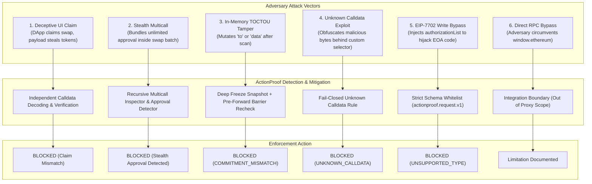

# ActionProof — Threat Model & Attack Matrix

## 1. Attack-Defense Hierarchy Diagram

---

## 2. Threat Matrix

| Threat ID | Threat Name | Adversary Technique | ActionProof Defense Mechanism | Severity | Outcome |
| :--- | :--- | :--- | :--- | :--- | :--- |
| **THREAT-01** | **UI Deception / Phishing Claim** | Compromised frontend renders "Claim Rewards" while calldata calls `transferFrom(...)` or drains ETH. | Frontend text treated as **UNTRUSTED CLIENT CLAIM**. Calldata independently decoded and verified against registry. | Critical | **BLOCKED** |
| **THREAT-02** | **Stealth Multicall Approval** | Attacker batches a normal swap with `token.approve(attacker, MAX_UINT256)` inside `Multicall3.aggregate3`. | Multicall engine recursively unpacks nested call array. Policy engine detects unannounced approval. | Critical | **BLOCKED** |
| **THREAT-03** | **Post-Verification Mutation (TOCTOU)** | Hostile script modifies `tx.to` in the JavaScript heap after policy check passes, before wallet receives request. | Pre-forward barrier re-canonicalizes outgoing request and verifies $\mathcal{C}_{\text{fwd}} \equiv \mathcal{C}_{\text{verified}}$. | Critical | **COMMITMENT_ MISMATCH (BLOCKED)** |
| **THREAT-04** | **Getter / Proxy Trap Manipulation** | Attacker passes object with getter returning benign value on read #1 (scanner) and malicious value on read #2 (wallet). | `snapshotRequest()` invokes getters once, deep-clones values, and recursively calls `Object.freeze()`. | High | **BLOCKED / DEFUSED** |
| **THREAT-05** | **Unknown / Opaque Calldata** | Attacker submits unverified custom contract payload hoping scanner fails open or issues passive warning. | Strict **Fail-Closed** policy: unknown function selectors cannot produce `VERIFIED`. | High | **BLOCKED (UNKNOWN_CALLDATA)** |
| **THREAT-06** | **Unsupported Protocol Bypass (EIP-7702)** | Attacker submits Type-4 transaction with `authorizationList` to delegate EOA code to drainer contract. | Canonical validator checks schema whitelist. Any presence of `authorizationList` triggers fail-closed. | Critical | **UNSUPPORTED (BLOCKED)** |
| **THREAT-07** | **Direct Provider Bypass** | Hostile script bypasses `window.ethereum` and sends raw JSON-RPC directly to Infura/Alchemy or local node. | Outside EIP-1193 proxy scope. ActionProof protects the provider path it owns. | N/A | **OUT OF SCOPE** |

---

## 3. Defense-in-Depth Design

ActionProof implements defense-in-depth through orthogonal validation layers:
1. **Structural Validation:** Rejects any payload violating `actionproof.request.v1` schema.
2. **Cryptographic Validation:** Hashing ensures zero drift between evaluated payload and forwarded payload.
3. **Semantic Validation:** ABI decoding and multicall inspection ensure every execution step is fully understood.
4. **Behavioral Simulation:** Predicted state changes confirm real balance impacts before user authorization.
