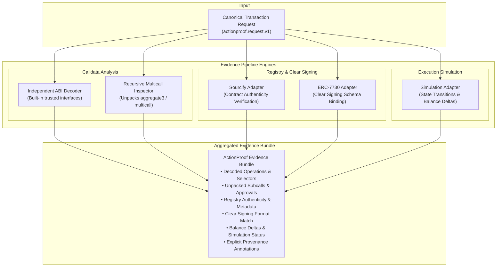

# ActionProof — Independent Evidence Pipeline

## 1. Evidence Pipeline Architecture Diagram

---

## 2. Component Deep Dives

### 2.1. Independent ABI Decoder (`src/analysis/decoder.ts`)
Decentralized applications cannot be trusted to provide honest ABI definitions for their transactions. ActionProof performs independent decoding using built-in, immutable interface dictionaries:
* **Selector Extraction:** Parses the leading 4 bytes (`0x` + 8 hex characters) from `data`.
* **Standard Interface Support:**
  * **ERC-20:** `transfer(address,uint256)`, `approve(address,uint256)`, `transferFrom(address,address,uint256)`.
  * **Uniswap V2 / V3:** `swapExactTokensForTokens`, `exactInputSingle`.
  * **Multicall3:** `aggregate3`, `aggregate`, `multicall`.
* **Safe Parsing:** Parameter offsets and dynamic byte arrays (strings, bytes) are parsed defensively to prevent out-of-bounds slicing or buffer overflow exploits.

### 2.2. Recursive Multicall Inspector (`src/analysis/multicall.ts`)
Complex DeFi protocols use multicall contracts to bundle actions. Malicious payloads frequently hide high-risk actions (e.g. infinite token approvals) inside seemingly benign swap bundles:
1. Detects calls targeted at recognized multicall contracts or functions (`0xac9650d8`, `0x5ae401dc`).
2. Recursively parses the tuple array `(address target, bool allowFailure, bytes callData)`.
3. Traverses nested multicalls up to a recursion depth limit (defending against recursive stack exhaustion).
4. Emits individual `CallTreeNode` objects for each internal action, enabling policy rules `RULE_03` and `RULE_04` to inspect sub-operations and catch contradictions independently.

### 2.3. Contract Identity & Sourcify Adapter (`src/analysis/contract.ts`)
Validates that the target contract address matches authenticated source code:
* **Registry Status:** Queries contract verification status (`FULL_MATCH`, `PARTIAL_MATCH`, `UNVERIFIED`).
* **Provenance Tracking:** In the current MVP demo, verification results are provided via a deterministic `LOCAL_FIXTURE` adapter, avoiding flaky external network calls while maintaining identical API contracts for production `LIVE_REGISTRY` providers.

### 2.4. Clear Signing & ERC-7730 Adapter (`src/intent/erc7730.ts`)
ERC-7730 establishes a standard format for mapping smart contract calldata to structured, human-readable clear signing displays:
* Matches function signatures against pre-registered ERC-7730 schemas.
* Formats values, addresses, and parameters into user-understandable statements (e.g., *"Swap exactly 100 USDC on Uniswap V3"*).
* Cross-validates parameters against decoded calldata, raising `DESCRIPTOR_MISMATCH` if discrepancy is detected.

### 2.5. Simulation Adapter & Honest Provenance (`src/analysis/simulation.ts`)
Predicts transaction consequences before authorization:
* **State Diff Analysis:** Calculates predicted token balance deltas (e.g. `-100 USDC`, `+0.038 ETH`).
* **Revert Detection:** Identifies transactions that would fail on-chain.
* **Explicit Provenance Annotations:** ActionProof never pretends that fixture simulations are live network calls. Every simulation result includes an explicit `provenance` tag:
  * `LIVE_BACKEND`: Executed against an active fork or JSON-RPC node via `eth_call` / debug tracing.
  * `LOCAL_FIXTURE`: Executed against deterministic local simulation fixtures for hermetic testing and demonstration.
  * `UNAVAILABLE`: Simulation provider not configured or network unreachable (emits policy `WARNING`).
* **TOCTOU Advisory:** ActionProof explicitly documents that simulations are point-in-time predictions; between simulation time and mining time, on-chain state can change (front-running, sandwich attacks).
