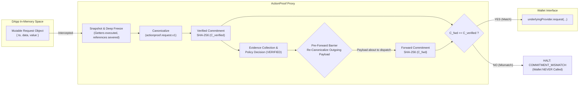

# ActionProof — Level-2 Provider Request Binding & Tamper Resistance

## 1. The Level-2 Provider Binding Architecture



---

## 2. The Formal Binding Invariant

The ActionProof Level-2 Provider Binding Invariant is defined as:

$$\forall T \in \text{Transactions}, \quad \text{Dispatch}(T_{\text{fwd}}) \iff \mathcal{H}(\mathcal{N}(T_{\text{fwd}})) \equiv \mathcal{C}_{\text{verified}}$$

Where:
* $\mathcal{N}(x)$ is the canonical normalization function under the strict `actionproof.request.v1` schema.
* $\mathcal{H}(x)$ is the deterministic SHA-256 serialization and hashing function.
* $\mathcal{C}_{\text{verified}}$ is the cryptographic commitment produced during initial snapshot analysis.
* $T_{\text{fwd}}$ is the payload object forwarded to `underlyingProvider.request()`.

If any condition results in $\mathcal{H}(\mathcal{N}(T_{\text{fwd}})) \neq \mathcal{C}_{\text{verified}}$, the transaction dispatch is aborted, the promise is rejected, and the underlying wallet is never called.

---

## 3. Anti-Tamper & Anti-Accessor Hardening

In dynamic JavaScript environments, an adversary can attempt to subvert verification through several runtime vectors:

### 3.1. Dynamic Property Getters
```typescript
// Exploit Pattern: Return benign value to ActionProof, malicious value to wallet
let readCount = 0;
const payload = {
  get to() {
    return (readCount++ === 0) 
      ? "0x68b3465833fb72A70ecDF485E0e4C7bD8665Fc45" // Uniswap
      : "0xAttackerContract000000000000000000000000"; // Attacker
  }
};
```
**ActionProof Defense:**  
`snapshotRequest()` accesses each property exactly once during the initial snapshot, copying the primitive value into a brand-new object created via `Object.create(null)`. The object is then deeply frozen using `Object.freeze()`. Dynamic getters cannot re-execute.

### 3.2. Reference Mutation (TOCTOU)
```typescript
// Exploit Pattern: Mutate properties after verification has passed
const payload = { to: uniswapRouter, data: swapData };
const promise = provider.request({ method: "eth_sendTransaction", params: [payload] });
// Background timer or microtask mutates destination
payload.to = attackerAddress;
```
**ActionProof Defense:**  
1. ActionProof discards the original userland object reference and performs all verification on its frozen internal snapshot.
2. The payload passed to the underlying wallet is derived from the verified snapshot itself or, in mutation testing scenarios, checked via the `PreForwardBarrier`.
3. If an attacker manages to tamper with the outgoing parameter array, `PreForwardBarrier.assertForwardingIntegrity()` catches the hash mismatch and halts execution.

### 3.3. Nested Object Mutation & Prototype Pollution
Objects containing nested structures (such as `accessList` arrays containing address and storage key tuples) are recursively cloned and frozen. Prototype chains are sanitized, preventing prototype pollution attacks on `Object.prototype`.

---

## 4. Pre-Forward Barrier Implementation

The pre-forward barrier is located in [`src/provider/preForwardBarrier.ts`](file:///C:/Coding/Projects/Crypto_Fair/src/provider/preForwardBarrier.ts):

```typescript
export function assertForwardingIntegrity(
  forwardRequest: unknown,
  verifiedCommitment: string
): void {
  // 1. Snapshot the forwarded payload
  const snapshot = snapshotRequest(forwardRequest);
  
  // 2. Normalize under actionproof.request.v1
  const canonical = canonicalizeRequest(snapshot);
  
  // 3. Compute commitment
  const forwardCommitment = computeCommitment(canonical);
  
  // 4. Cryptographic integrity check
  if (forwardCommitment !== verifiedCommitment) {
    throw new ActionProofSecurityError(
      "COMMITMENT_MISMATCH",
      `Forwarding integrity violation: commitment ${forwardCommitment} does not match verified commitment ${verifiedCommitment}`
    );
  }
}
```

This ensures that under no circumstances can an altered request be transmitted to the underlying wallet.
