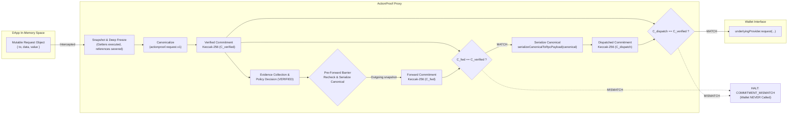

# ActionProof — Level-2 Provider Request Binding & Tamper Resistance

## 1. The Level-2 Provider Binding Architecture


```mermaid
flowchart LR
    subgraph DApp In-Memory Space
        Req["Mutable Request Object<br/>{ to, data, value }"]
    end

    subgraph ActionProof Proxy
        Snap["Snapshot & Deep Freeze<br/>(Getters executed, references severed)"]
        Canon1["Canonicalize<br/>(actionproof.request.v1)"]
        Hash1["Verified Commitment<br/>Keccak-256 (C_verified)"]
        
        Eval["Evidence Collection &<br/>Policy Decision (VERIFIED)"]

        Barrier{"Pre-Forward Barrier<br/>Recheck & Serialize Canonical"}
        Hash2["Forward Commitment<br/>Keccak-256 (C_fwd)"]
        Check{"C_fwd == C_verified ?"}
        Derive["Serialize Canonical<br/>serializeCanonicalToRpcPayload(canonical)"]
        Hash3["Dispatched Commitment<br/>Keccak-256 (C_dispatch)"]
        Check2{"C_dispatch == C_verified ?"}
    end

    subgraph Wallet Interface
        Forward["underlyingProvider.request(...)"]
    end

    Req -->|"Intercepted"| Snap
    Snap --> Canon1 --> Hash1
    Hash1 --> Eval --> Barrier
    Barrier -->|"Outgoing snapshot"| Hash2
    Hash1 & Hash2 --> Check
    Check -->|"MATCH"| Derive
    Derive --> Hash3
    Hash1 & Hash3 --> Check2
    Check2 -->|"MATCH"| Forward
    Check -.->|"MISMATCH"| Halt["HALT: COMMITMENT_MISMATCH<br/>(Wallet NEVER Called)"]
    Check2 -.->|"MISMATCH"| Halt
```

---

## 2. The Formal Binding Invariant

The ActionProof Level-2 Provider Binding Invariant is defined as:

$$\forall T \in \text{Transactions}, \quad \text{Dispatch}(T_{\text{fwd}}) \iff \mathcal{H}(\mathcal{N}(T_{\text{fwd}})) \equiv \mathcal{C}_{\text{verified}}$$

Where:
* $\mathcal{N}(x)$ is the canonical normalization function under the strict `actionproof.request.v1` schema domain (`src/canonical/commitment.ts`).
* $\mathcal{H}(x)$ is the deterministic Ethereum Keccak-256 serialization and hashing function via `viem` `keccak256(stringToBytes(serialized))`.
* $\mathcal{C}_{\text{verified}}$ is the cryptographic commitment produced during initial snapshot analysis.
* $T_{\text{fwd}}$ is the payload object forwarded to `underlyingProvider.request()`.

If any condition results in $\mathcal{H}(\mathcal{N}(T_{\text{fwd}})) \neq \mathcal{C}_{\text{verified}}$, the transaction dispatch is aborted, the promise is rejected, and the underlying wallet is never called.

---

## 3. Anti-Tamper & Anti-Accessor Hardening

In dynamic JavaScript environments, an adversary can attempt to subvert verification through several runtime vectors:

### 3.1. Dynamic Property Getters
```typescript
// Exploit Pattern: Return benign value to ActionProof, malicious value to wallet
let readCount = 0;
const payload = {
  get to() {
    return (readCount++ === 0) 
      ? "0x68b3465833fb72A70ecDF485E0e4C7bD8665Fc45" // Uniswap
      : "0xAttackerContract000000000000000000000000"; // Attacker
  }
};
```
**ActionProof Defense:**  
`createImmutableSnapshot()` (`src/provider/snapshot.ts`) accesses each property exactly once during the initial snapshot, copying the primitive value into a brand-new object created via `Object.create(null)`. The object is then deeply frozen using `Object.freeze()`. Dynamic getters cannot re-execute.

### 3.2. Reference Mutation (TOCTOU)
```typescript
// Exploit Pattern: Mutate properties after verification has passed
const payload = { to: uniswapRouter, data: swapData };
const promise = provider.request({ method: "eth_sendTransaction", params: [payload] });
// Background timer or microtask mutates destination
payload.to = attackerAddress;
```
**ActionProof Defense:**  
1. ActionProof discards the original userland object reference and performs all verification on its frozen internal snapshot.
2. The dispatched RPC payload is derived directly from the verified canonical representation using:
   `serializeCanonicalToRpcPayload(canonical)`
3. The system then re-verifies the dispatched payload commitment against the verified commitment before calling `wallet.request()`. If any divergence is detected, execution aborts with `COMMITMENT_MISMATCH` or `DISPATCH_COMMITMENT_MISMATCH`.

### 3.3. Nested Object Mutation & Prototype Pollution
Objects containing nested structures (such as `accessList` arrays containing address and storage key tuples) are recursively cloned and frozen. Prototype chains are sanitized, preventing prototype pollution attacks on `Object.prototype`.

---

## 4. Pre-Forward Commitment Recheck & Canonical Serialization

The pre-forward commitment recheck and canonical RPC serialization are executed in-line within `ActionProofProviderProxy.executeSendTransaction()` in [`src/provider/proxy.ts`](file:///C:/Coding/Projects/Crypto_Fair/src/provider/proxy.ts):

```typescript
// 1. Create an immutable verified forwarding snapshot immediately prior to pre-forward recheck.
let forwardPayload: Record<string, unknown>;
try {
  forwardPayload = createImmutableSnapshot(liveRequest) as Record<string, unknown>;
  validateRequestShape(forwardPayload);
} catch (err: unknown) {
  return {
    verdict: 'BLOCKED',
    txHash: null,
    reason: 'UNCANONICALIZABLE_FORWARD_REQUEST',
    // ...
  };
}

// 2. Pre-forward recheck: immediately recompute commitment on the outgoing snapshot
const forwardCommitment = computeCommitment(forwardPayload, activeWalletChainId);

// 3. Strict commitment equality invariant
if (forwardCommitment.hash !== verifiedCommitment.hash) {
  evidence.binding.status = 'MISMATCH';
  evidence.binding.forwardCommitment = forwardCommitment.hash;
  evidence.policy.verdict = 'BLOCKED';

  return {
    verdict: 'BLOCKED',
    txHash: null,
    reason: 'COMMITMENT_MISMATCH',
    detail: `Verified [${verifiedCommitment.hash.slice(0, 10)}...] != Forward [${forwardCommitment.hash.slice(0, 10)}...]`,
    commitment: verifiedCommitment.hash,
    forwardCommitment: forwardCommitment.hash,
    evidence,
    blockedBeforeForwarding: true,
  };
}

// 4. Derive dispatched RPC payload directly from verified canonical representation (M2 & M3)
const forwardRpcPayload = serializeCanonicalToRpcPayload(verifiedCommitment.canonical);

// 5. Verify dispatched payload commitment matches verified commitment before calling wallet
const dispatchedCommitment = computeCommitment(forwardRpcPayload, activeWalletChainId);
if (dispatchedCommitment.hash !== verifiedCommitment.hash) {
  evidence.binding.status = 'MISMATCH';
  evidence.policy.verdict = 'BLOCKED';
  return {
    verdict: 'BLOCKED',
    reason: 'DISPATCH_COMMITMENT_MISMATCH',
    // ...
  };
}

// 6. Forward ONLY the verified canonical payload to the underlying wallet
const rawTxHash = await this.wallet.request({
  method: 'eth_sendTransaction',
  params: [forwardRpcPayload],
});
```

This ensures that under no circumstances can an altered or non-canonical request be transmitted to the underlying wallet.
