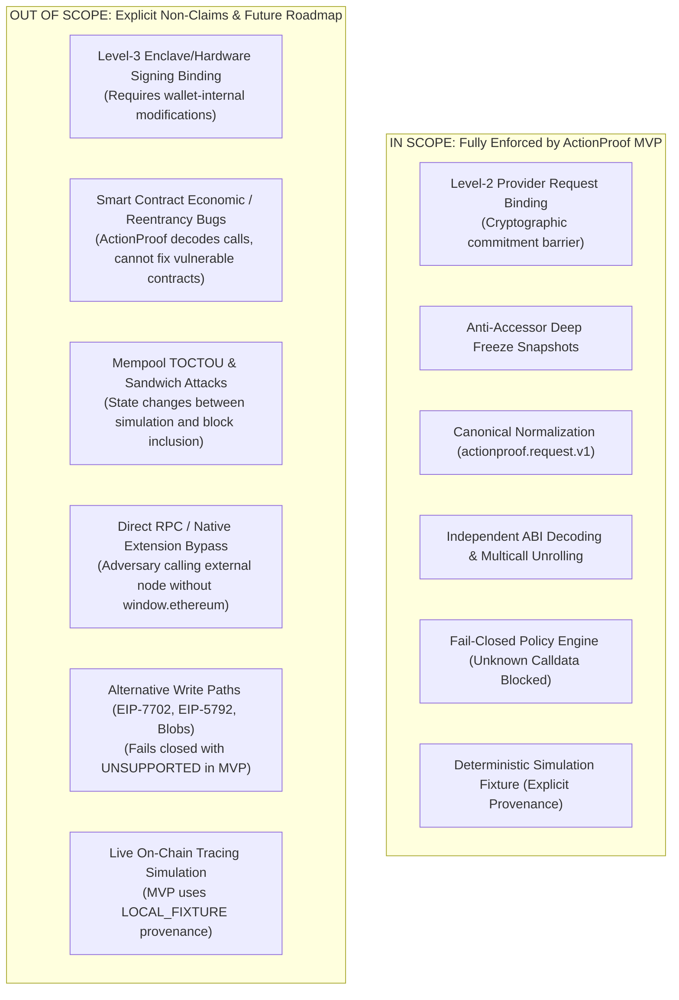

# ActionProof — Explicit Scope, Limitations & Non-Claims

## 1. MVP Boundary & Unsupported Scope Diagram

---

## 2. Honest Security Boundaries & Non-Claims

ActionProof places maximum emphasis on security honesty. We explicitly document what the current MVP guarantees and what lies beyond its boundary:

### 2.1. Level-2 vs. Level-3 Signing Payload Binding
* **What ActionProof Proves (Level-2):** Within any integration where ActionProof wraps the EIP-1193 provider path to the wallet, the transaction request payload forwarded to `underlyingProvider.request()` is mathematically identical to the request verified under the `actionproof.request.v1` schema.
* **What ActionProof Does NOT Prove (Level-3):** ActionProof operates as an external provider wrapper. It **cannot inspect or control** the internal memory of the wallet extension, the wallet's RLP serialization, or the cryptographic signature generated inside a hardware wallet or secure enclave. Level-3 requires wallet-internal implementation.

### 2.2. Smart Contract Logic and Economic Vulnerabilities
* ActionProof independently decodes calldata, validates contract identity on Sourcify, and checks ERC-7730 intent descriptors.
* However, ActionProof **does not audit smart contract logic in real time**. If a user interacts with a verified Uniswap or lending pool that suffers a reentrancy attack or oracle manipulation, ActionProof accurately verifies the call parameters, but cannot prevent contract-level economic failure.

### 2.3. Simulation Time-of-Check to Time-of-Use (TOCTOU)
* State diffs and balance deltas generated by execution simulation reflect the blockchain state at the time of the simulation call.
* In public Ethereum mempools, transaction order is not final until block inclusion. Front-running, MEV sandwich attacks, and state changes occurring between user authorization and transaction inclusion are inherent to public blockchains and cannot be eliminated by pre-signing client scanners.

### 2.4. Direct Provider Bypass
* ActionProof protects the standard EIP-1193 provider path (`window.ethereum`).
* If a compromised browser environment contains malware that establishes its own independent WebSocket or HTTP connection directly to an external RPC node (Infura, Alchemy), or injects code directly into the wallet extension's background service worker, it bypasses the EIP-1193 interface entirely.

### 2.5. Simulation Provenance: Local Fixture vs. Live Node
* The MVP demo and automated test suite utilize a deterministic **`LOCAL_FIXTURE`** simulation adapter.
* We do **not** claim live blockchain execution during the evaluation demo. The simulation architecture is fully pluggable, but demo results are generated hermetically to ensure determinism and zero network flakiness.

### 2.6. Unsupported Transaction Schemas
* Modern transaction formats such as EIP-7702 (`authorizationList`), EIP-4844 (`blobs`), and EIP-5792 (`wallet_sendCalls`) are not yet fully supported by the canonical schema.
* ActionProof handles these safely by **failing closed (`UNSUPPORTED`)**, refusing to forward unverified modern write formats.
